# Resultados visuales EAAE-BCU: total, industria y subramas

Fuente de datos: `data/analysis-data/20260706_resultados_eaae_bcu_total_industria_subrama.xlsx`.

Este informe replica la lógica argumental del informe `docs/20260605_eaae_resultados_eaae_oyanthaabal_total_industria.md`, pero usa el libro largo de resultados EAAE-BCU para comparar economía total, industria manufacturera agregada y subramas industriales homologadas. Las figuras se generan con `command-files/analysis-command-files/05_visualizar_resultados_eaae_bcu_subrama.R` y se guardan como PNG para visualización directa en GitHub.

## Criterios de lectura

- La columna `seccion` funciona como filtro: `economia_total`, `industria-total` o grupo de subrama industrial homologado.
- La representatividad EAAE/BCU compara el VAB EAAE contra el VAB BCU disponible en la misma escala de la hoja usada.
- Las tasas de ganancia, la descomposición del VAB y la participación industrial se muestran en valores corrientes para conservar la cobertura 2001-2024.
- Las ganancias indexadas, el capital adelantado y la productividad usan resultados en precios constantes, deflactados con índices BCU empalmados a base 2005=1.
- El capital adelantado usa `stock_capital_imputado` y `capital_circulante_adelantado`; la rotación operativa es `rotacion_calibrada_sobre_6_6`.
- Las subramas industriales se leen como grupos CIIU Rev.4 compatibles, no como divisiones Rev.4 puras.

## Resultados agregados

### 1. Representatividad de la serie EAAE en relación a PBI BCU

Compara el VAB corriente EAAE con el VAB corriente de referencia de BCU para economía total e industria.

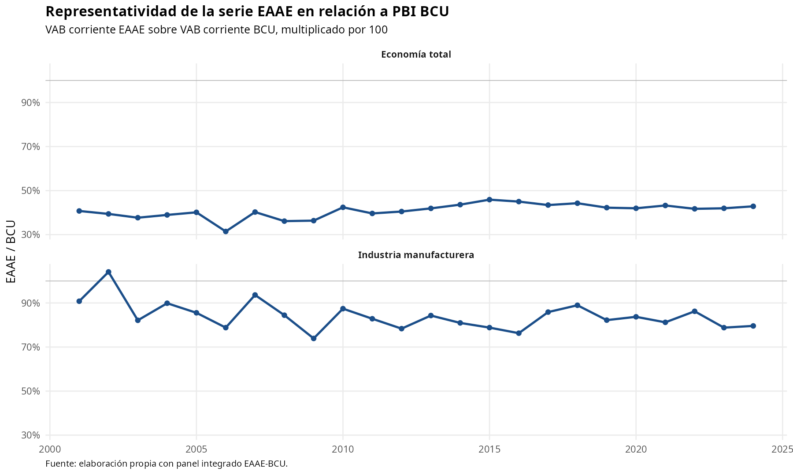

### 2. Tasa de ganancia

La tasa se calcula como ganancia sobre `stock_capital_imputado + capital_circulante_adelantado`. Se presentan las variantes a precios básicos y a precios productor.

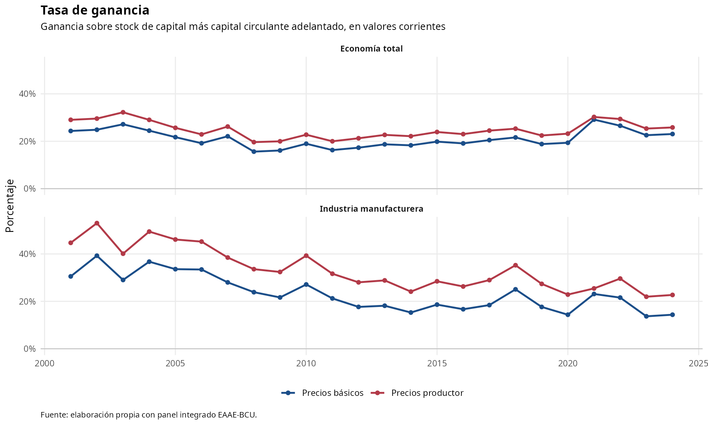

### 3. Ganancia en índice 2005=1

Compara la dinámica real de la ganancia a precios básicos y productor. La base común facilita comparar economía total e industria aunque sus niveles difieran.

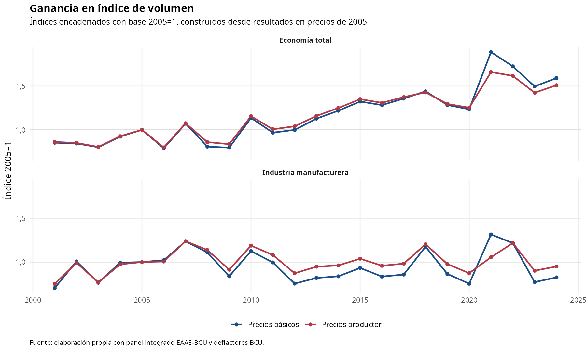

### 4. Descomposición del VAB: economía total

Distribuye el VAB a precios productor entre costo laboral, consumo de capital fijo y ganancia a precios productor.

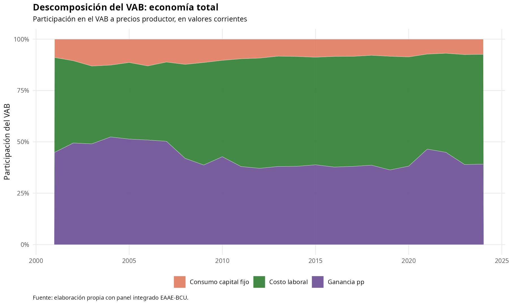

### 5. Descomposición del VAB: industria

Replica la misma descomposición para la rama industrial agregada, permitiendo evaluar si su estructura difiere de la economía total.

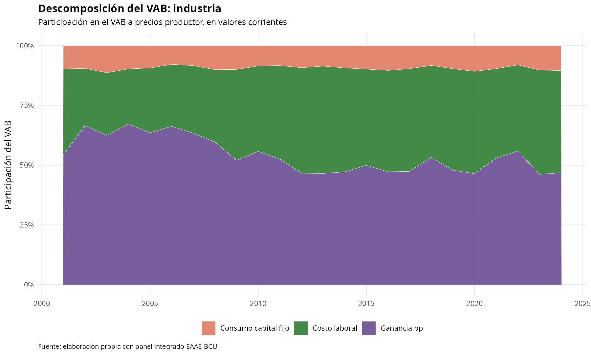

### 6. Capital adelantado y componentes

Muestra el stock de capital, el capital circulante adelantado y el capital total adelantado en precios de 2005. Las escalas se separan por ámbito para no ocultar la dinámica industrial.

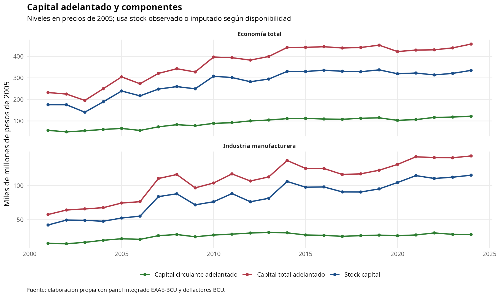

### 7. Participación industrial en el VAB total

Mide el peso de la industria manufacturera dentro del VAB total de la economía.

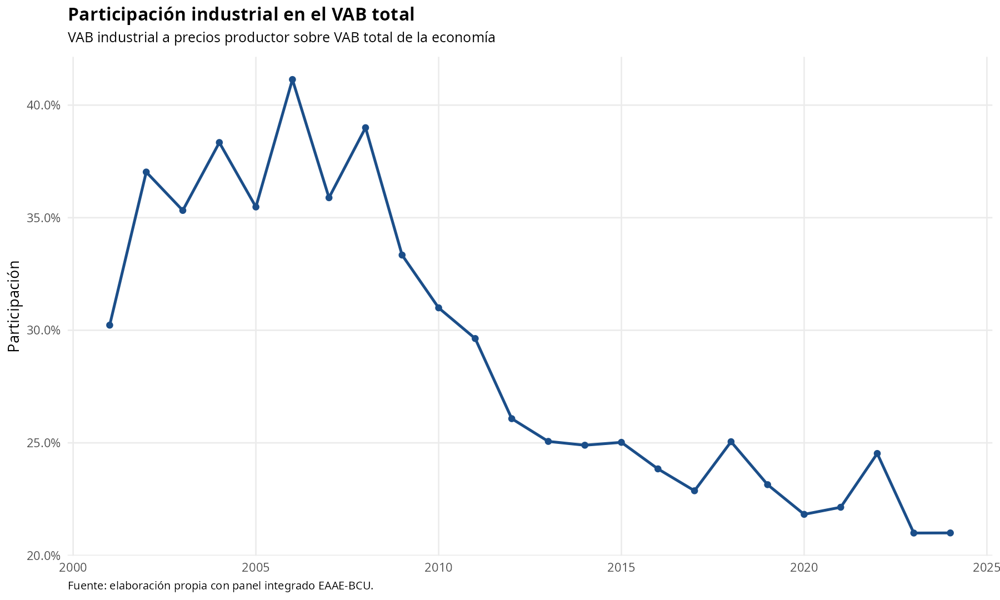

### 8. Inversión manufacturera

Muestra la FBCF industrial en precios de 2005 en el eje derecho y la misma inversión como porcentaje del VAB manufacturero en el eje izquierdo.

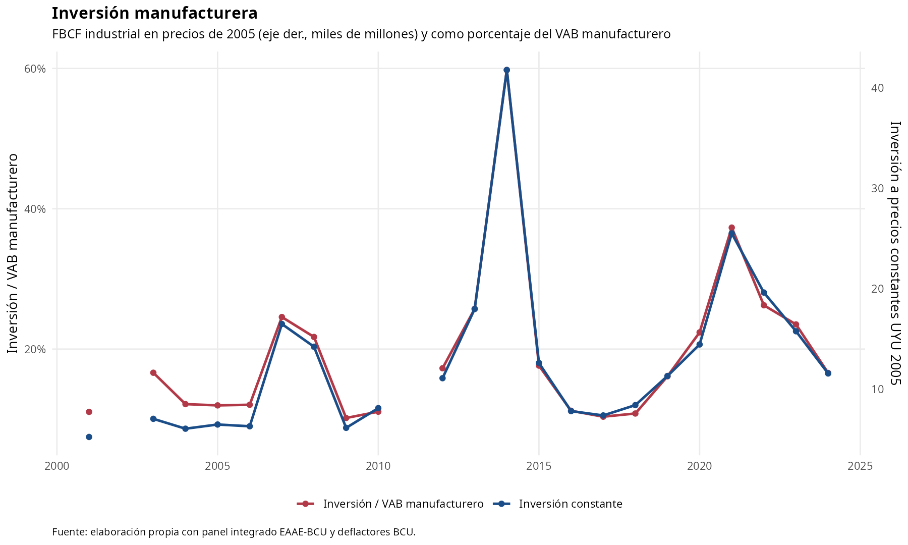

### 9. Resultados en índices

Compara en dos paneles, economía total e industria, la evolución del VAB, la masa salarial, la ganancia y el capital adelantado en índices con base 2005=1.

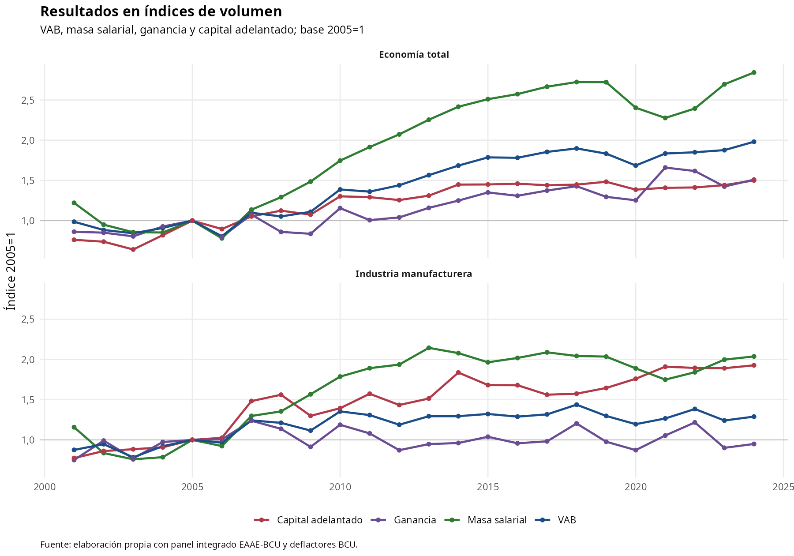

### 10. Productividad del trabajo en índice

Compara la evolución de la productividad del trabajo, medida como VAB a precios constantes por puesto de trabajo, para economía total y rama manufacturera.

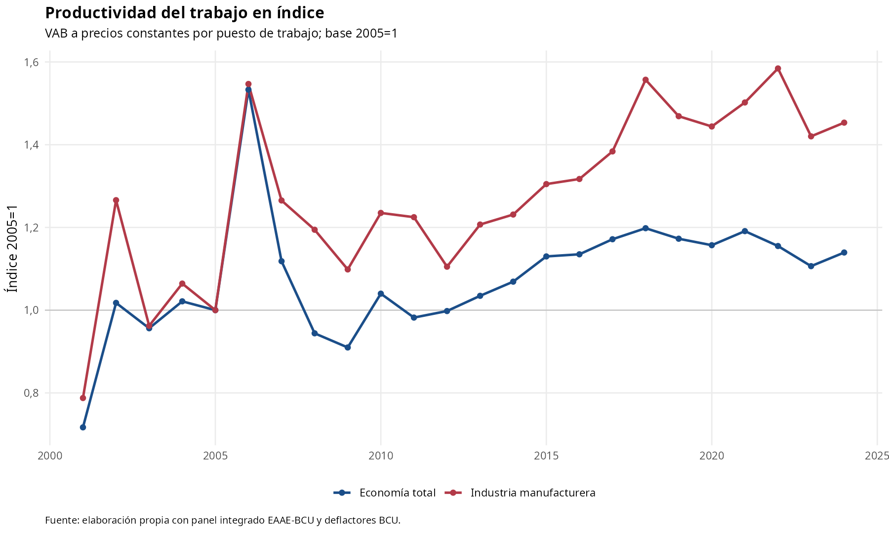

## Resultados por subrama industrial

La desagregación por subrama permite observar si la evolución manufacturera agregada se explica por un patrón común o por trayectorias sectoriales diferenciadas. Las subramas se presentan con la homologación CIIU Rev.4 compatible usada en el panel integrado.

### 11. Composición del VAB industrial por subrama

Muestra cómo se distribuye el VAB manufacturero corriente entre las subramas industriales homologadas.

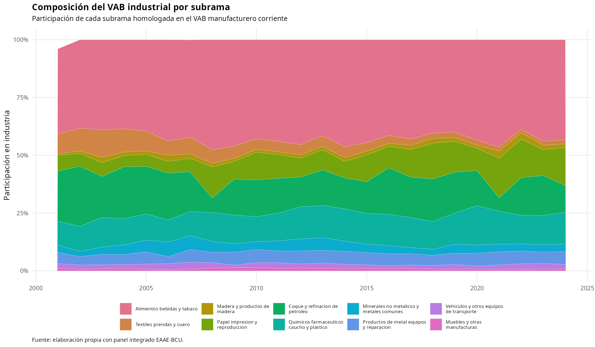

### 12. Tasa de ganancia por subrama industrial

Replica la tasa de ganancia a precios productor para cada subrama, usando la rotación calibrada sectorial y el stock de capital imputado cuando corresponde.

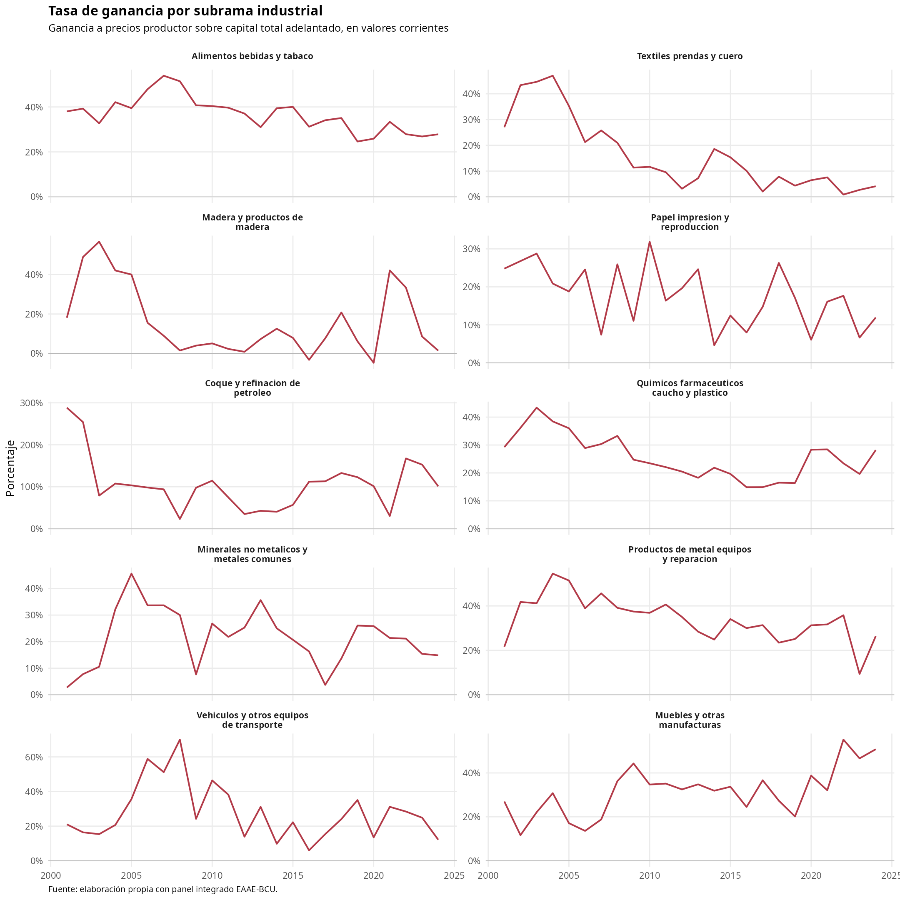

### 13. Resultados por subrama en índices

Compara VAB, masa salarial, ganancia y capital adelantado en índices base 2005=1 dentro de cada subrama.

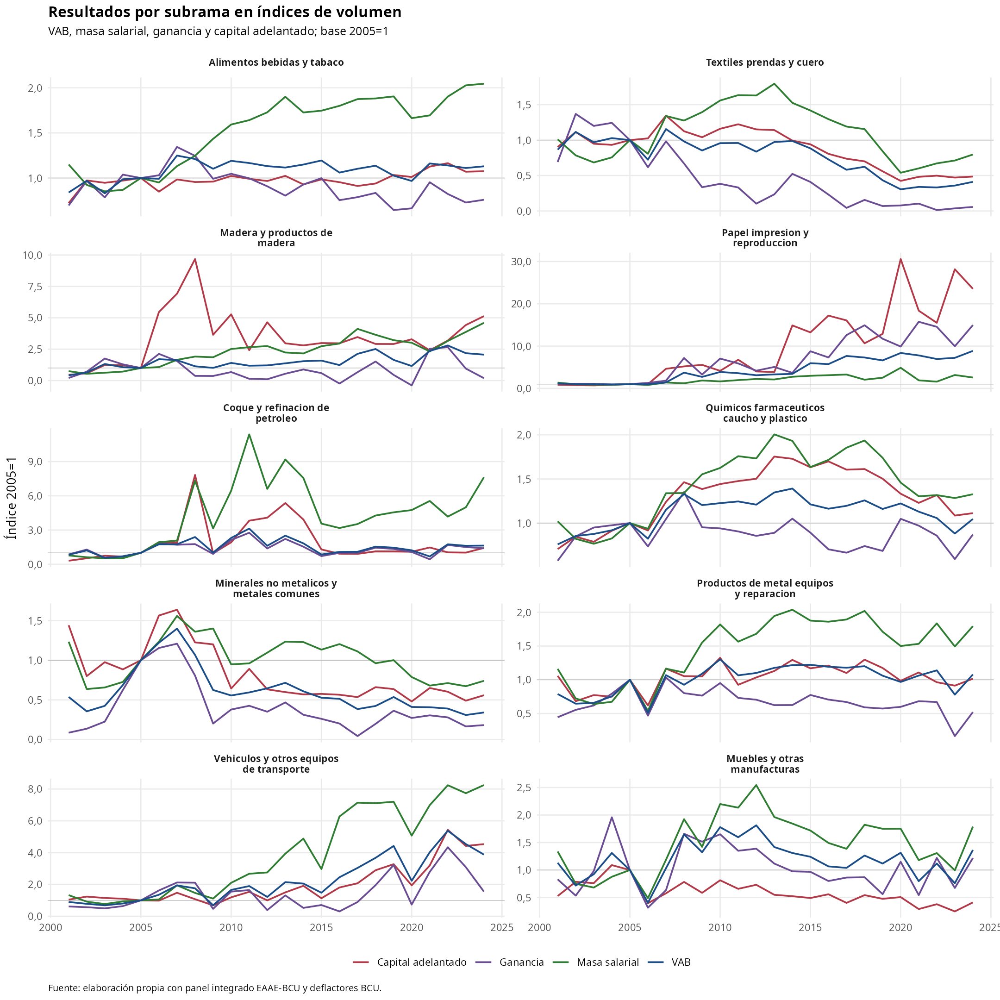

### 14. Productividad del trabajo por subrama

Mide la productividad como VAB a precios constantes por puesto de trabajo, expresada como índice con base 2005=1.

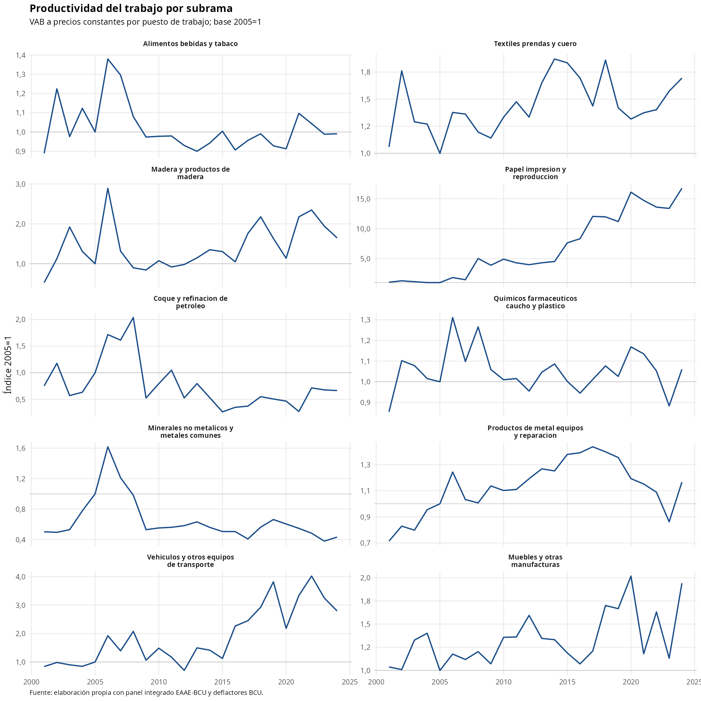

## Reproducción

Desde la raíz del repositorio:

```bash
Rscript command-files/analysis-command-files/05_visualizar_resultados_eaae_bcu_subrama.R
```
