# Resultados EAAE-BCU: tasa de ganancia en tres niveles

Fuente de datos: `data/analysis-data/20260727_resultados_eaae_bcu_total_industria_subrama.xlsx`.

Esta minuta actualiza el informe `docs/20260706_resultados_eaae_bcu_total_industria_subrama.md` incorporando un tercer nivel agregado: industria manufacturera depurada de `17_18_papel_impresion` y `19_refinacion`. La tasa de ganancia de ese nivel se calcula desde sumas agregadas de ganancia y capital adelantado, no como promedio de tasas subramales.

## Criterios de lectura

- Todos los resultados construidos provienen de la EAAE. Se usan índices de precios del BCU para deflactar valores corrientes.
- Los tres niveles agregados son `economia_total`, `industria-total` e `industria-sin-papel-coque-refinacion`.
- Las tasas de ganancia se muestran a precios básicos y a precios productor.
- Las descomposiciones del VAB usan valores corrientes para conservar cobertura anual completa.
- Las comparaciones de volumen usan resultados deflactados con índices BCU empalmados a base 2005=1.
- La manufactura depurada excluye el grupo papel/impresión/reproducción y coque/refinación de petróleo; por la homologación disponible no separa papel de impresión.

## Resultados agregados

### 1. Representatividad y peso manufacturero

La primera lectura compara el peso de la manufactura en BCU, el peso de la manufactura en EAAE y la cobertura de la manufactura EAAE respecto de la manufactura BCU. Se presentan como paneles separados para evitar mezclar lecturas de composición y representatividad.
Puede observarse cómo el peso de la manufactura está sobre representado en la EAAE (panel 1 vs panel 2) mientras que en general esta fuente representa entre el 80% y 90% del VAB reportado a nivel de cuentas nacionales, a lo largo de todo el período.

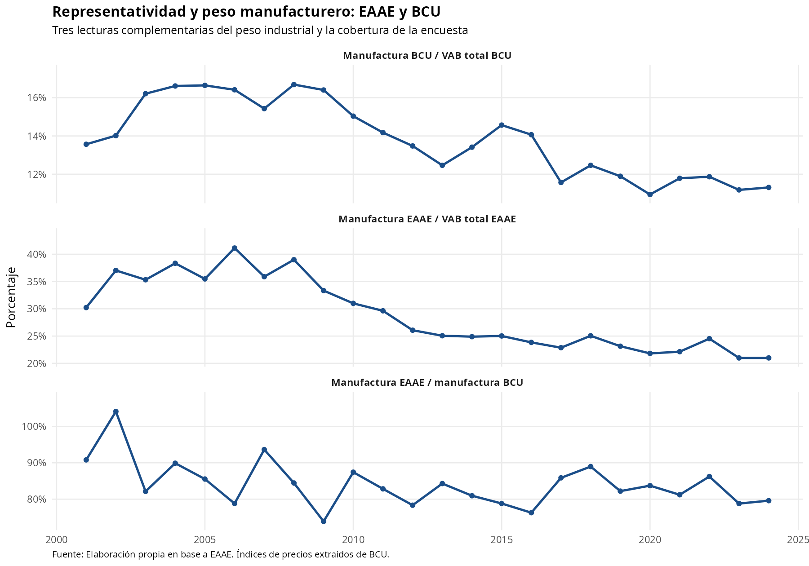

La segunda lectura compara el peso de la manufactura depurada dentro de la manufactura total, usando tanto el VAB como el stock de capital operativo. Esta depuración permite dimensionar el peso de los grupos excluidos antes de interpretar las tasas de ganancia.


A continuación se presenta una comparación entre la tasa de ganancia calculada a partir de eaae y aquella calculada a partir de cuentas nacionales por Gabriel Oyanthabal. Esto con el fin de complementar la evaluación de representatividad de los cálculos hechos a partir de eaae.

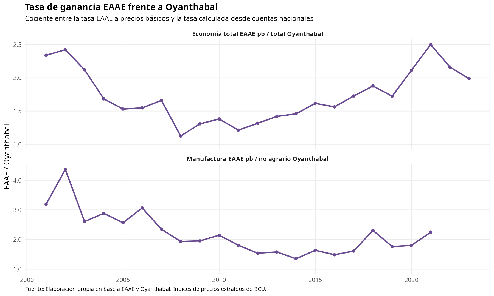

### 2. Tasa de ganancia

La comparación principal incorpora tres niveles: economía total, manufactura total y manufactura depurada. La manufactura depurada permite observar cuánto cambia la trayectoria al retirar los grupos con comportamiento más singular dentro de la rama industrial.

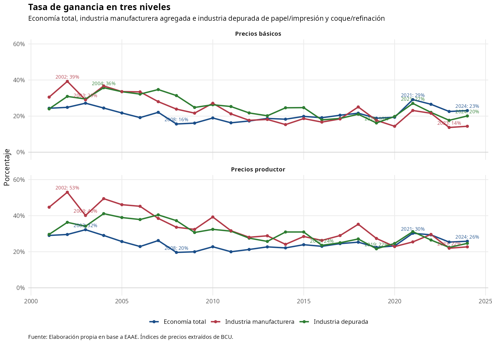

### 3. Descomposición del VAB: economía total

La descomposición distribuye el VAB a precios productor entre costo laboral, consumo de capital fijo y ganancia a precios productor. Las etiquetas marcan años extremos, años de referencia y el último punto disponible.

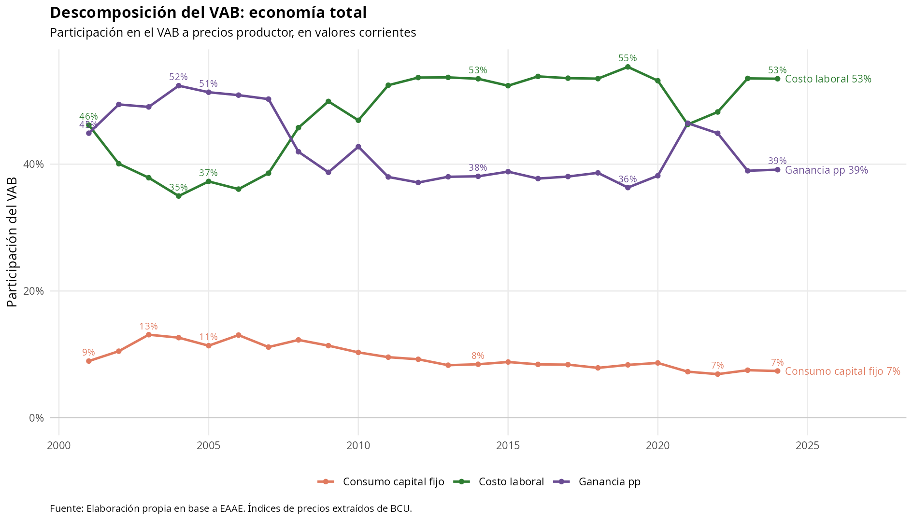

### 4. Descomposición del VAB: industria

La misma descomposición se replica para la manufactura agregada. Esta figura ayuda a distinguir si los cambios de tasa de ganancia provienen de la ganancia, del costo laboral o del consumo de capital fijo.

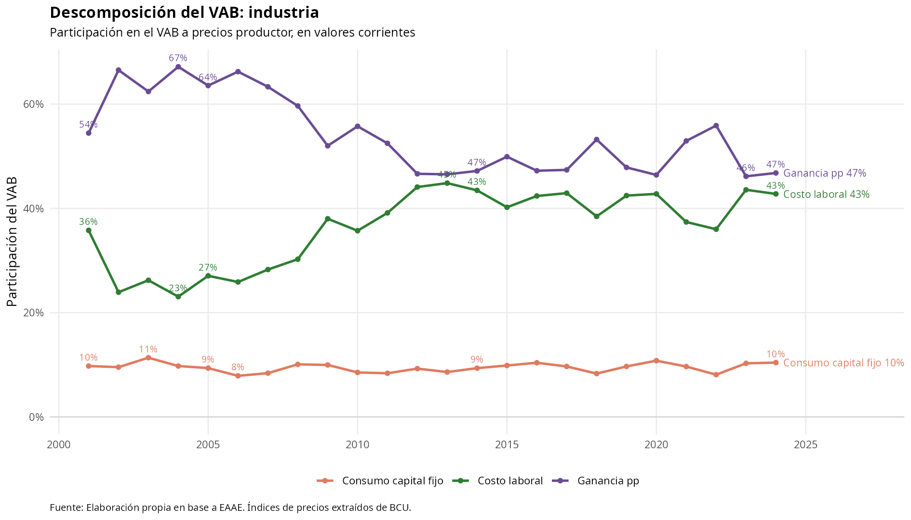

### 5. Capital adelantado, VAB y ganancia

Este gráfico deja las variables en base 100 en 2004. Se excluye el capital total adelantado para evitar duplicar sus componentes y se agregan VAB y ganancia a precios constantes como referencia de desempeño.

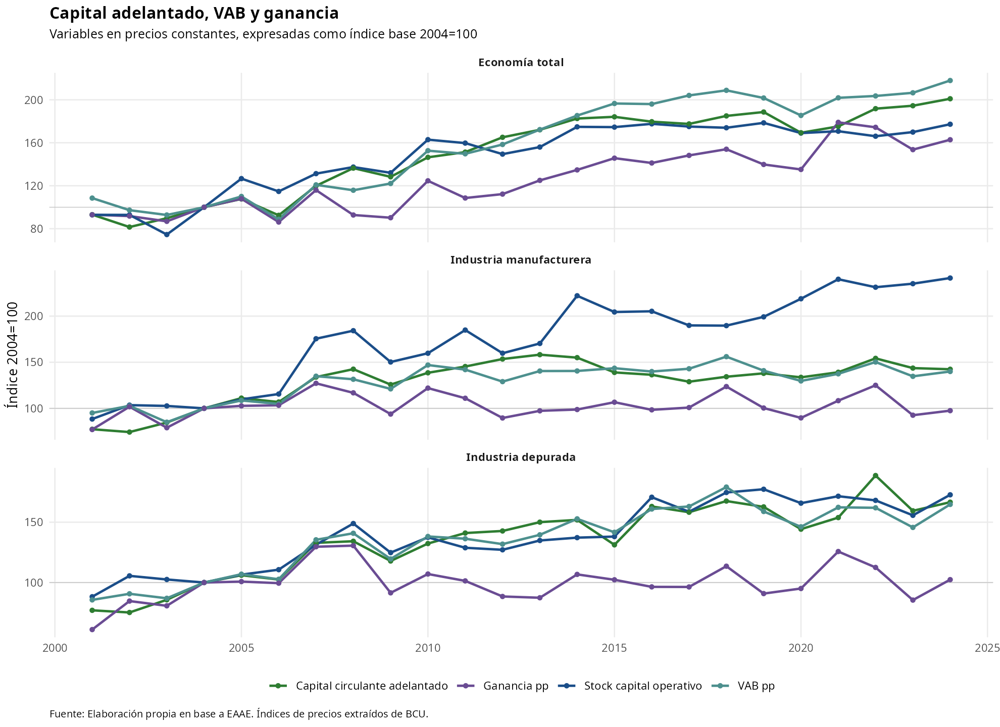

### 6. Inversión manufacturera

La inversión manufacturera se separa en dos paneles y en cada uno se diferencia entre industria manufacturera total e industria depurada. Esto permite revisar si la depuración cambia la lectura del esfuerzo inversor.

En el primer panel la industria depurada está incorporada, pero queda prácticamente superpuesta con la manufactura total porque la FBCF subramal se distribuye proporcionalmente al VAB; por eso el cociente FBCF/VAB es casi idéntico para ambos agregados. Para facilitar la lectura, la manufactura total se muestra con línea punteada y punto hueco.

El máximo de inversión/VAB ocurre en 2014; papel, impresión y reproducción representa 13.8% de la FBCF manufacturera constante en ese año.

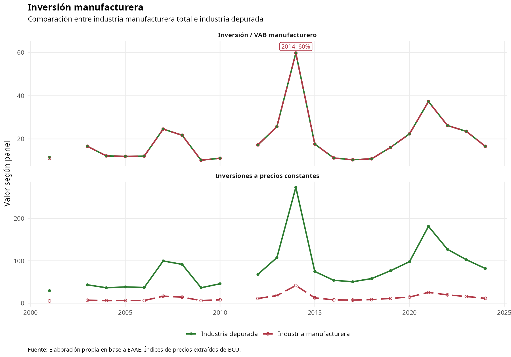

### 7. Resultados manufactureros en índices

La comparación se focaliza en manufactura total y manufactura depurada para VAB, ganancia y capital adelantado. Esto permite evaluar si la depuración cambia sólo niveles o también la dinámica relativa.

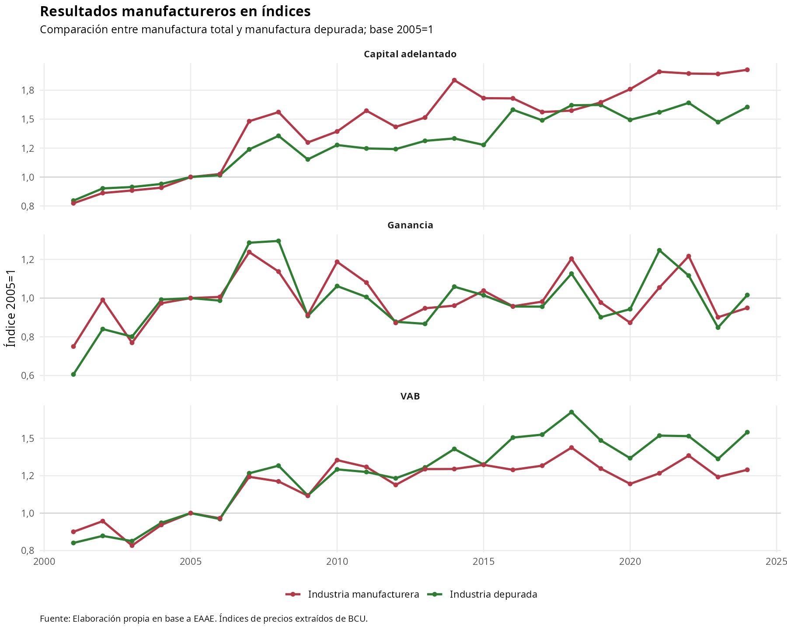

### 8. Productividad del trabajo

La productividad se calcula como VAB a precios constantes por puesto de trabajo. Se mantienen las tres líneas agregadas para comparar economía total, manufactura total y manufactura depurada.

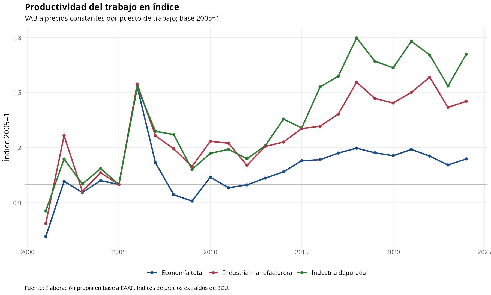

## Anexos

### 9. Ganancia industrial en índice de volumen

Se desplaza esta figura al anexo porque funciona como síntesis de la dinámica real de la ganancia industrial, luego de revisar composición, capital adelantado, inversión y productividad.

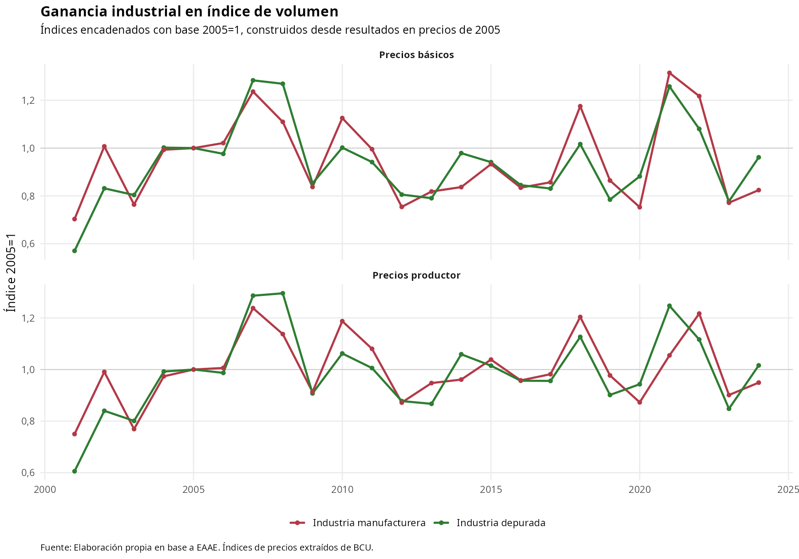

### 10. Tasa de ganancia a diferentes niveles de desagregación: exploración inicial

Referencia por subrama: se comparan economía total, industria manufacturera total, industria manufacturera depurada y los dos grupos excluidos de la depuración. La figura muestra tasas a precios básicos y a precios productor, con etiquetas en puntos de quiebre relevantes.

En el panel de papel, impresión y reproducción, la serie a precios básicos también está incluida. Su trayectoria se superpone casi exactamente con la de precios productor, por lo que el gráfico distingue ambas mediante tipo de línea: precios básicos en línea continua y precios productor en línea punteada.

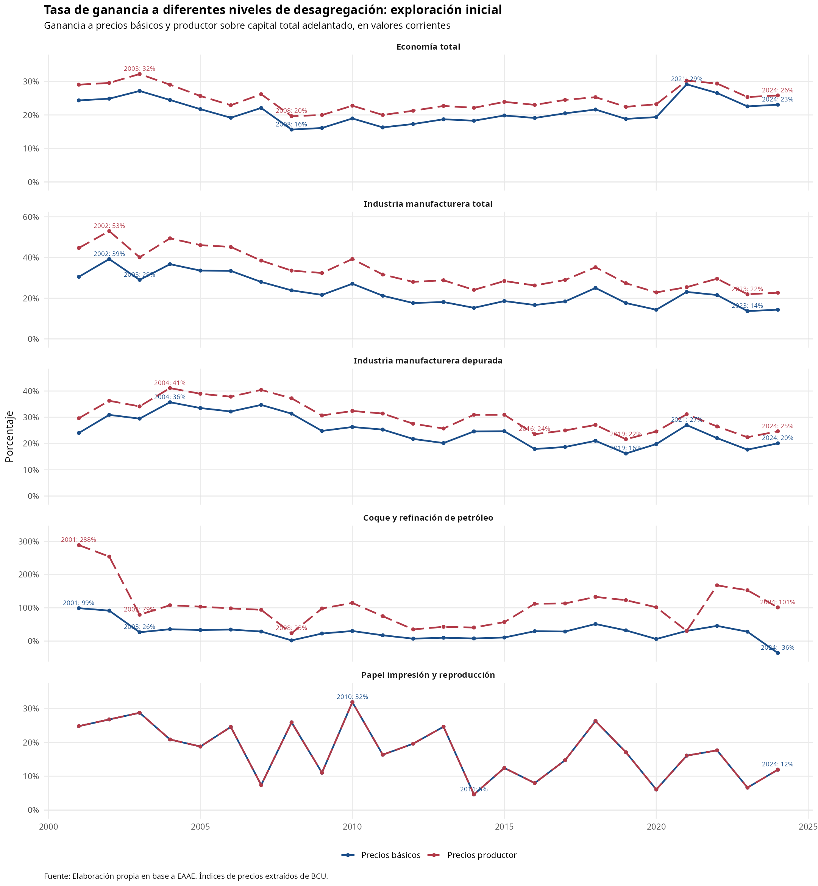

## Reproducción

Desde la raíz del repositorio:

```bash
Rscript command-files/analysis-command-files/06_visualizar_resultados_eaae_bcu_tres_niveles.R
```
