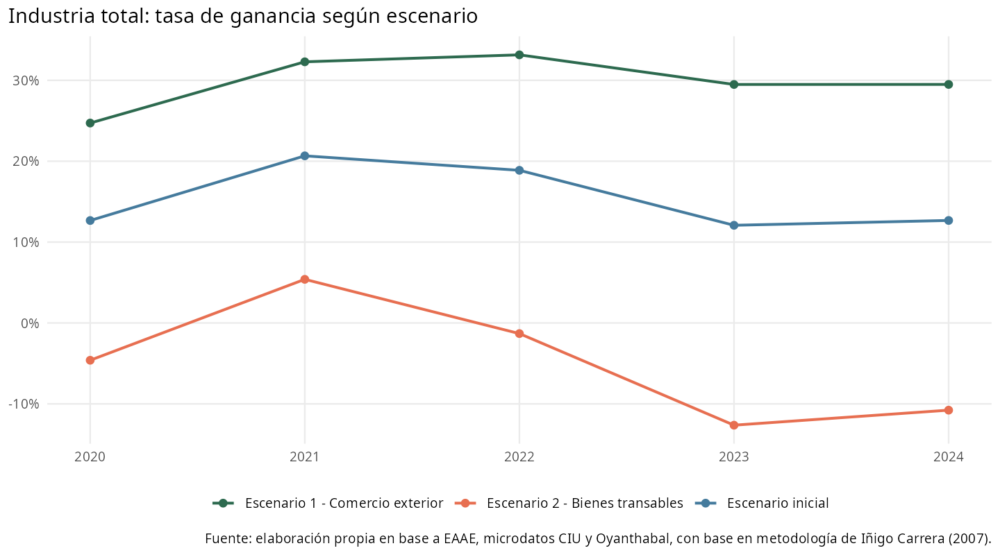
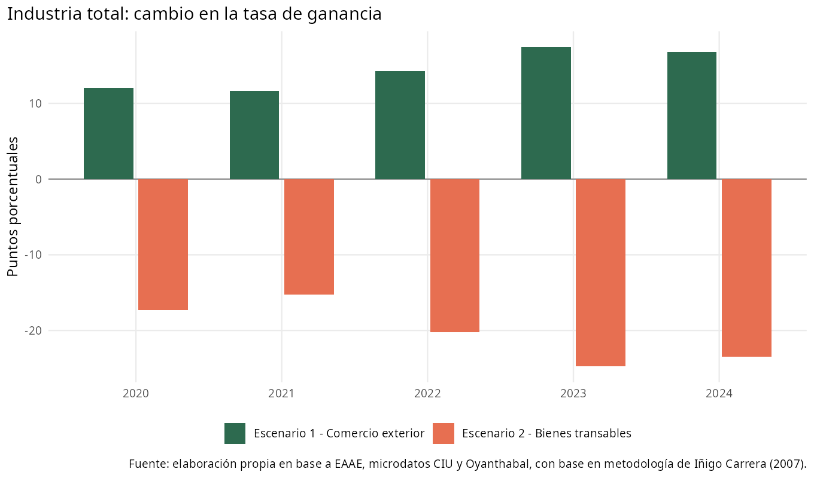
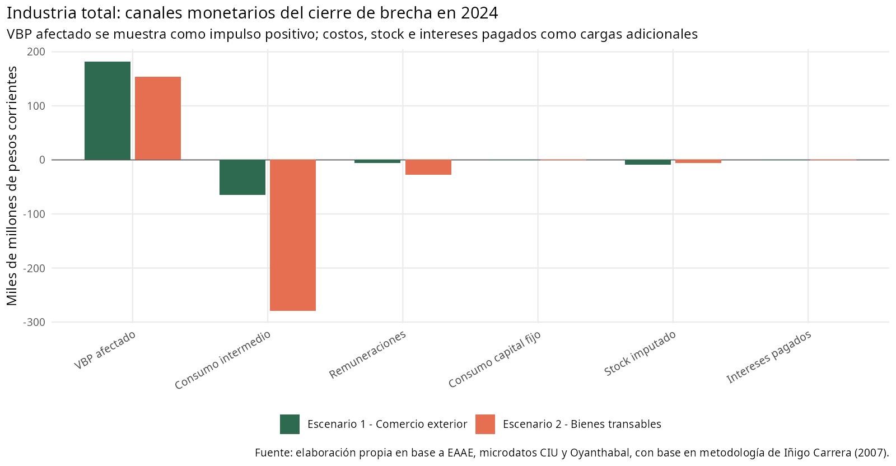
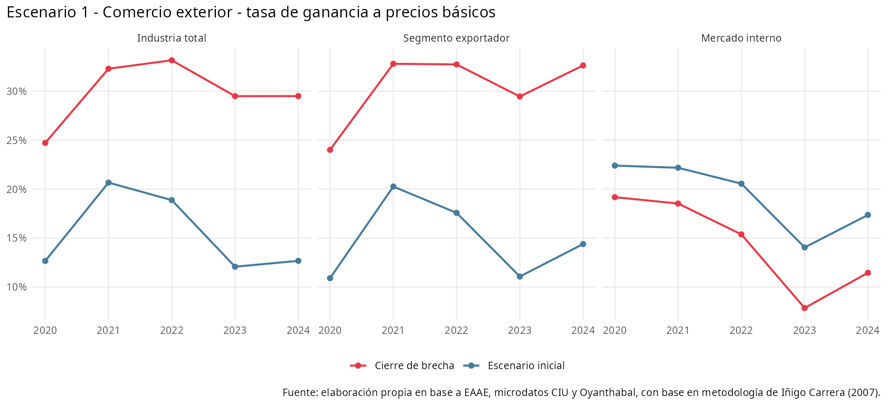
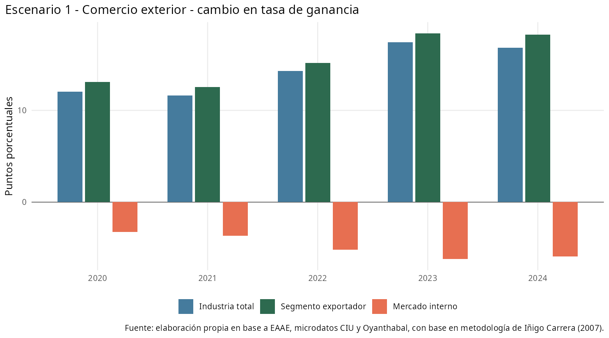
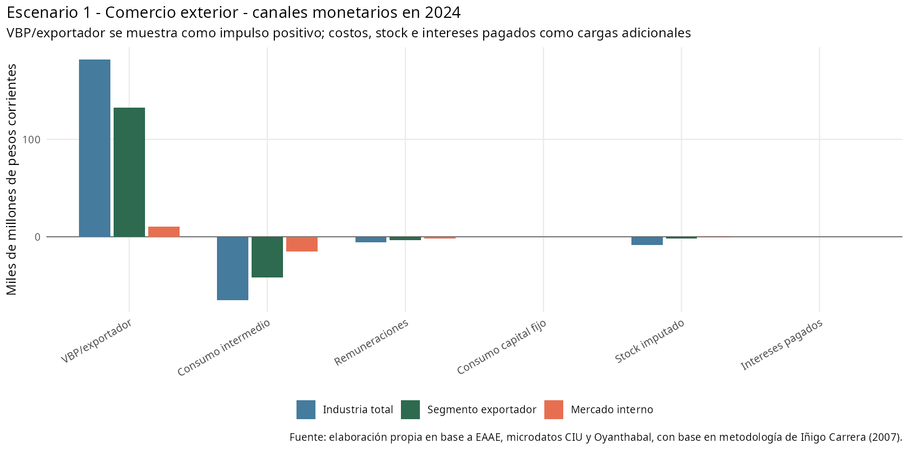
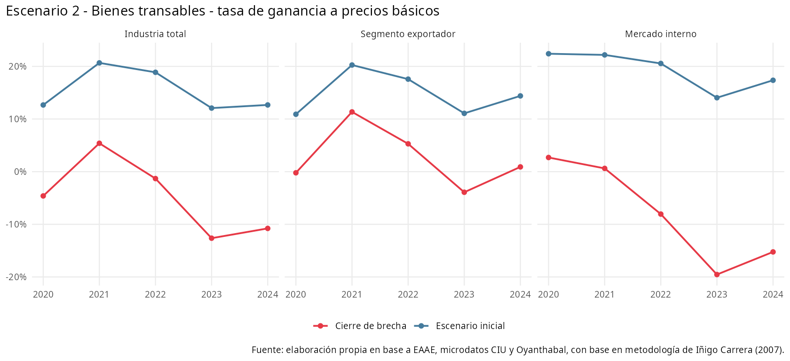
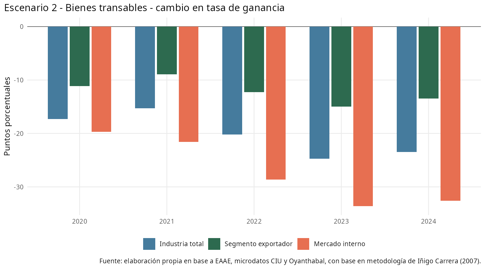
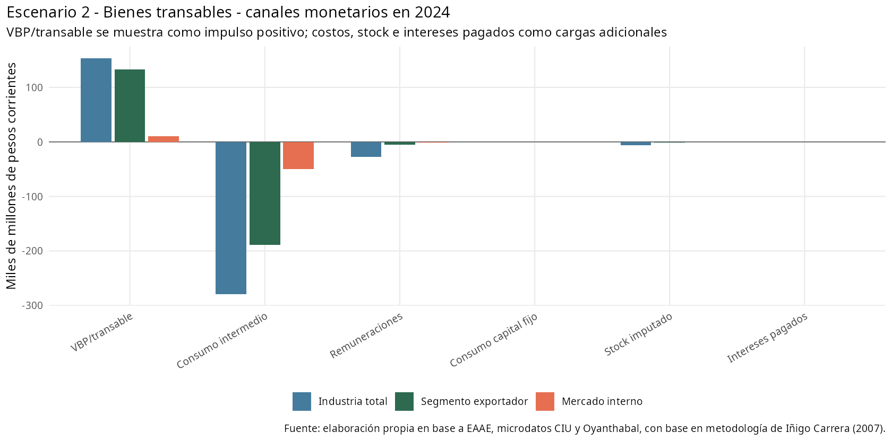

# Análisis integrado de escenarios de devaluación industrial, 2020-2024

Fuente de trabajo: `data/analysis-data/20260827_panel_eaae_2020_2024_industria_escenario_devaluacion.xlsx`, hojas `escenario-inicial`, `Escenario 1 - Comercio Exterior` y `Escenario 2 - Bienes Transables`.

Esta minuta integra los dos ejercicios de cierre de brecha cambiaria construidos para la industria manufacturera uruguaya. El objetivo es comparar, primero a nivel de industria general, cómo cambia la tasa de ganancia bajo dos supuestos de incidencia; luego se presenta una lectura separada de cada escenario para industria total, segmento exportador y segmento orientado al mercado interno.

El ejercicio debe leerse como una forma de dimensionar la apropiación de riqueza asociada a sostener un tipo de cambio comercial por debajo del tipo de cambio de paridad. En todos los casos se trabaja año a año, sin efectos acumulados ni cambios en cantidades, productividad o estructura productiva.

## 1. Industria general: lectura comparada de los dos escenarios

La comparación agregada muestra dos resultados claramente distintos. En el escenario de comercio exterior, el canal positivo asociado al VBP afectado por comercio exterior domina sobre los aumentos de costos, capital e intereses. En el escenario de bienes transables, el aumento modelado de costos y componentes transables del capital pesa más que el impulso sobre el VBP, llevando la tasa agregada a un resultado negativo en el tramo final.





| Escenario | TG base prom. | TG escenario prom. | Cambio prom. | TG base 2024 | TG escenario 2024 | Cambio 2024 | Var. ganancia 2024 |
| --- | --- | --- | --- | --- | --- | --- | --- |
| Escenario 2 - Bienes transables | 15,4% | -4,8% | -20,2 pp | 12,7% | -10,8% | -23,5 pp | -196,0% |
| Escenario 1 - Comercio exterior | 15,4% | 29,8% | +14,4 pp | 12,7% | 29,5% | +16,8 pp | 142,3% |

El contraste de componentes en 2024 permite ver el mecanismo: el escenario 1 tiene un delta de VBP mayor que los costos modelados; el escenario 2 incorpora una incidencia mucho más alta sobre consumo intermedio y masa salarial, por lo que el cierre de brecha deteriora la rentabilidad agregada.



| Componente | Escenario 1 | Escenario 2 |
| --- | --- | --- |
| VBP afectado | 182,1 | 153,5 |
| Consumo intermedio | 64,9 | 278,9 |
| Remuneraciones | 5,6 | 27,5 |
| Consumo capital fijo | 0,3 | 0,3 |
| Stock imputado | 8,7 | 5,9 |
| Intereses pagados | 0,3 | 0,3 |

## 2. Escenario 1 - Comercio Exterior

La apropiación de riqueza vía sobrevaluación de la moneda se aplica a los componentes importados de costos y capital y a la parte exportada de la producción. Por tanto, recoge el efecto directo de importaciones y exportaciones sobre la tasa de ganancia.

En este escenario, el efecto positivo opera sobre la parte de la producción directamente asociada al comercio exterior, mientras los efectos negativos se aplican sobre componentes importados de costos, capital fijo, stock e intereses. Por eso, el resultado favorece especialmente al segmento exportador.

En 2024, la industria total pasa de 12,7% a 29,5%, con un cambio de +16,8 pp.
El segmento exportador registra un cambio de +18,2 pp en 2024, mientras que el segmento mercado interno registra -5,9 pp.





| Sección | TG base prom. | TG escenario prom. | Cambio prom. | TG base 2024 | TG escenario 2024 | Cambio 2024 | Var. ganancia 2024 |
| --- | --- | --- | --- | --- | --- | --- | --- |
| Segmento exportador | 14,8% | 30,3% | +15,5 pp | 14,4% | 32,6% | +18,2 pp | 131,9% |
| Industria total | 15,4% | 29,8% | +14,4 pp | 12,7% | 29,5% | +16,8 pp | 142,3% |
| Mercado interno | 19,3% | 14,5% | -4,8 pp | 17,4% | 11,5% | -5,9 pp | -30,3% |



Coeficientes usados:

| Sección | Variable afectada | Incidencia |
| --- | --- | --- |
| Industria total | Consumo capital fijo | 1,7% |
| Industria total | Consumo intermedio | 18,9% |
| Industria total | Intereses pagados | 8,5% |
| Industria total | Masa salarial | 9,3% |
| Industria total | Stock imputado | 3,7% |
| Industria total | VBP/exportador | 39,5% |
| Mercado interno | Consumo capital fijo | 1,1% |
| Mercado interno | Consumo intermedio | 22,7% |
| Mercado interno | Intereses pagados | 8,5% |
| Mercado interno | Masa salarial | 9,3% |
| Mercado interno | Stock imputado | 1,8% |
| Mercado interno | VBP/exportador | 10,7% |
| Segmento exportador | Consumo capital fijo | 0,8% |
| Segmento exportador | Consumo intermedio | 18,1% |
| Segmento exportador | Intereses pagados | 8,5% |
| Segmento exportador | Masa salarial | 9,3% |
| Segmento exportador | Stock imputado | 0,9% |
| Segmento exportador | VBP/exportador | 42,0% |

## 3. Escenario 2 - Bienes Transables

La apropiación de riqueza vía sobrevaluación alcanza al conjunto de mercancías cuyos precios internos se rigen por precios internacionales, aunque sean producidas localmente y vendidas en el mercado interno. Así, incorpora la revaluación de producción local transable y su efecto sobre la tasa de ganancia.

En este escenario, la incidencia no queda limitada al comercio exterior directo. También se consideran mercancías producidas localmente cuyos precios internos se rigen por precios internacionales. Esto amplía el peso de los componentes afectados, en particular consumo intermedio y masa salarial, y modifica de manera sustantiva el resultado de rentabilidad.

En 2024, la industria total pasa de 12,7% a -10,8%, con un cambio de -23,5 pp.
El segmento exportador registra un cambio de -13,5 pp en 2024, mientras que el segmento mercado interno registra -32,6 pp.





| Sección | TG base prom. | TG escenario prom. | Cambio prom. | TG base 2024 | TG escenario 2024 | Cambio 2024 | Var. ganancia 2024 |
| --- | --- | --- | --- | --- | --- | --- | --- |
| Segmento exportador | 14,8% | 2,7% | -12,2 pp | 14,4% | 0,9% | -13,5 pp | -93,2% |
| Industria total | 15,4% | -4,8% | -20,2 pp | 12,7% | -10,8% | -23,5 pp | -196,0% |
| Mercado interno | 19,3% | -7,9% | -27,2 pp | 17,4% | -15,2% | -32,6 pp | -202,3% |



Coeficientes usados:

| Sección | Variable afectada | Incidencia |
| --- | --- | --- |
| Industria total | Consumo capital fijo | 1,7% |
| Industria total | Consumo intermedio | 81,2% |
| Industria total | Intereses pagados | 8,5% |
| Industria total | Masa salarial | 45,3% |
| Industria total | Stock imputado | 2,5% |
| Industria total | VBP/transable | 33,3% |
| Mercado interno | Consumo capital fijo | 1,1% |
| Mercado interno | Consumo intermedio | 76,4% |
| Mercado interno | Intereses pagados | 8,5% |
| Mercado interno | Masa salarial | 8,3% |
| Mercado interno | Stock imputado | 1,8% |
| Mercado interno | VBP/transable | 10,7% |
| Segmento exportador | Consumo capital fijo | 0,8% |
| Segmento exportador | Consumo intermedio | 82,0% |
| Segmento exportador | Intereses pagados | 8,5% |
| Segmento exportador | Masa salarial | 13,3% |
| Segmento exportador | Stock imputado | 0,9% |
| Segmento exportador | VBP/transable | 42,0% |

La fórmula común aplicada en ambos escenarios es:

```text
factor_devaluacion = tipo_cambio_paridad_pesos_usd / tipo_cambio_comercial_pesos_usd - 1
delta_variable = variable_base * incidencia_seccion_variable * factor_devaluacion
ganancia_pb_devaluacion = ganancia_pb + delta_vbp_pp - delta_consumo_intermedio_estimado - delta_remuneraciones - delta_consumo_capital_fijo
capital_total_adelantado_devaluacion = capital_total_adelantado + delta_stock_capital_imputado + (delta_remuneraciones + delta_consumo_intermedio_estimado) / rotacion_calibrada_sobre_6_6
tasa_ganancia_pb_devaluacion = ganancia_pb_devaluacion / capital_total_adelantado_devaluacion
```
