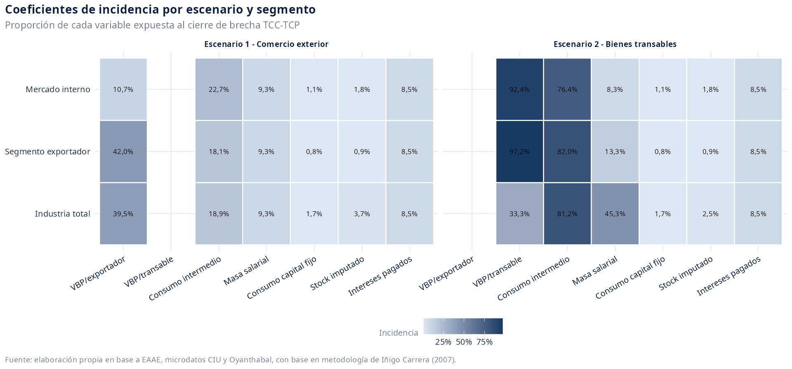
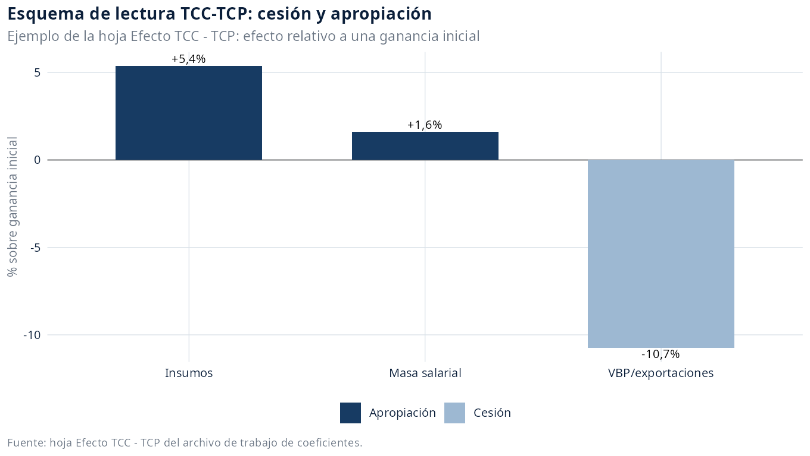
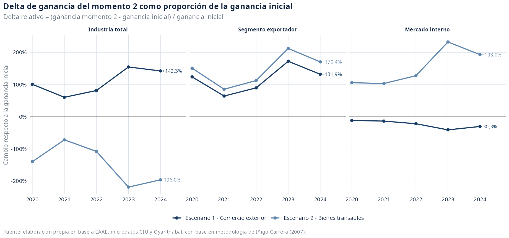
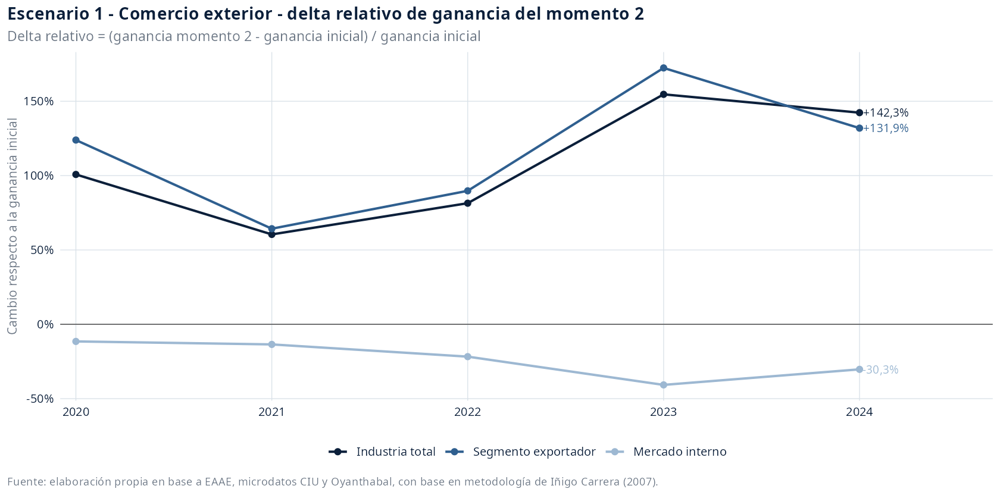
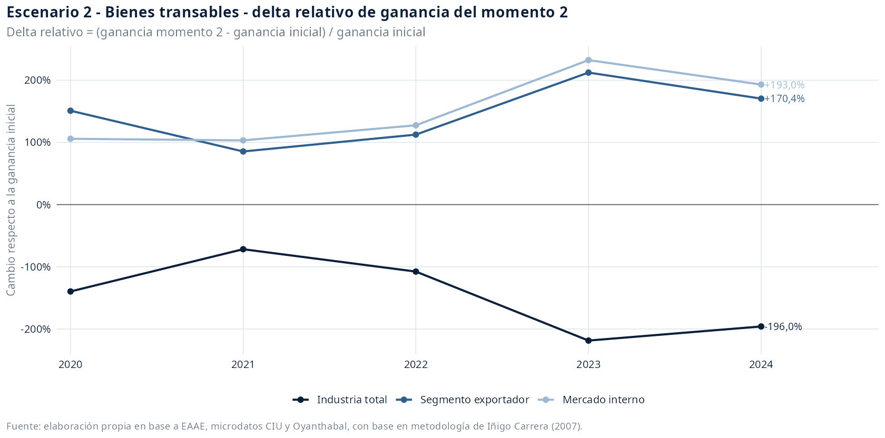

# Escenarios integrados: saldos de ganancia asociados a la sobrevaluación cambiaria industrial

Fuente de trabajo: `data/analysis-data/20260828_panel_eaae_2020_2024_industria_escenario_devaluacion.xlsx`, hojas `escenario-inicial`, `tipo-cambio`, `Escenario 1 - Comercio Exterior` y `Escenario 2 - Bienes Transables`.

## Introducción

Esta minuta integra los dos ejercicios de cierre de brecha cambiaria construidos para la industria manufacturera uruguaya. El primer escenario mide la incidencia directa del comercio exterior; el segundo amplía el ejercicio hacia bienes transables cuyos precios internos se rigen por precios internacionales.

La lectura se realiza desde el escenario inicial de sobrevaluación. Por eso, el resultado principal se expresa como saldo monetario y no como tasa de ganancia: `ganancia inicial - ganancia contrafactual con cierre de brecha`. Un valor negativo indica ganancia dejada de percibir bajo sobrevaluación; un valor positivo indica ganancia sobrepercibida bajo sobrevaluación. El cálculo se realiza año a año, sin efectos acumulados ni respuestas dinámicas de cantidades, productividad o estructura productiva.

## Síntesis

Las fuentes usadas son: EAAE para VBP, VAB, remuneraciones, consumo intermedio estimado, consumo de capital fijo, stock de capital y capital adelantado; Oyanthabal, con base en la metodología de Iñigo Carrera (2007), para los tipos de cambio comercial/paridad; microdatos del CIU para distribuir los intereses industriales entre ramas exportadoras y ramas orientadas al mercado interno; y la clasificación operativa de subramas industriales 2020-2024 usada para separar industria exportadora, mercado interno y combustible. Las fuentes sustantivas de los coeficientes se toman de la columna `Fuente` del XLSX de coeficientes y se reportan en las tablas correspondientes.

Se trabaja desde 2020 porque en ese tramo la fuente opera con ramas homogéneas. Extender el ejercicio al panel completo exigiría procesar distintas versiones CIIU, lo que vuelve incompatible diferenciar con criterio uniforme el segmento industrial exportador y el segmento orientado al mercado interno. Complementariamente, el período 2020-2024 es razonable para una lectura en valores corrientes porque evita grandes saltos de nivel asociados a cambios clasificatorios.

En 2024, el escenario de comercio exterior registra para la industria total un saldo de -111,3 miles de millones de pesos corrientes en ganancia a precios básicos. El escenario de bienes transables registra +153,2 miles de millones. La comparación muestra que el signo del saldo depende del balance entre valorización del VBP y encarecimiento de costos.

## Supuestos y escenarios

- `escenario-inicial` contiene los valores corrientes observados para industria total, segmento exportador y segmento mercado interno.
- `Escenario 1 - Comercio Exterior` contiene el contrafactual que recoge la incidencia directa de importaciones y exportaciones.
- `Escenario 2 - Bienes Transables` contiene el contrafactual que incorpora bienes transables producidos localmente y vendidos en el mercado interno.
- El cálculo se realiza año a año mediante `factor_devaluacion = tipo_cambio_paridad_pesos_usd / tipo_cambio_comercial_pesos_usd - 1`; no contempla efectos acumulados ni respuestas dinámicas de cantidades, precios relativos o productividad.
- El canal positivo se modela sobre `vbp_pp`; los canales negativos se modelan sobre consumo intermedio, remuneraciones, consumo de capital fijo, stock imputado e intereses pagados.
- La medida principal de esta minuta es `ganancia_pb`; como complemento se reporta `ganancia_pb_desp_intereses`.
- La medida relativa complementaria normaliza el cambio de la ganancia del momento 2 como `(ganancia_pb_momento_2 - ganancia_pb_inicial) / ganancia_pb_inicial * 100`; debe leerse como variación relativa de la masa de ganancia contrafactual, no como tasa de ganancia.
- Los intereses industriales son una serie agregada de manufactura y se distribuyen por segmento según microdatos del CIU: 65,6% para ramas exportadoras y 34,4% para ramas orientadas al mercado interno.
- El grupo `combustible` no se presenta como segmento autónomo en el libro de resultados ni en esta minuta; queda incorporado en la industria total y se conserva en el panel CSV para trazabilidad contable.

Ramas incluidas en el segmento exportador:
- 10: Elaboración de productos alimenticios
- 11 y 12: Elaboración de bebidas y elaboración de productos de tabaco
- 13: Fabricación de productos textiles
- 15: Fabricación de cueros y productos conexos
- 16: Producción de madera y fabricación de productos de madera y corcho, excepto muebles
- 17: Fabricación de papel y de los productos de papel
- 22: Fabricación de productos de caucho y plástico

Ramas incluidas en el segmento mercado interno:
- 14: Fabricación de prendas de vestir
- 18: Actividades de impresión y reproducción de grabaciones
- 20: Fabricación de sustancias y productos químicos
- 21: Fabricación de productos farmacéuticos, sustancias químicas medicinales y de productos botánicos
- 23: Fabricación de otros productos minerales no metálicos
- 24: Fabricación de metales comunes
- 25: Fabricación de productos derivados del metal, excepto maquinaria y equipo
- 26 y 27: Fabricación de los productos informáticos, electrónicos y ópticos. Fabricación de equipo eléctrico
- 28: Fabricación de maquinaria y equipo n.c.p
- 29 y 30: Fabricación de vehículos automotores, remolques y semirremolques. Fabricación de otros tipos de equipo de transporte
- 31: Fabricación de muebles
- 32: Otras industrias manufactureras
- 33: Reparación e instalación de la maquinaria y equipo


El factor de devaluación considerado se calcula año a año como `tipo_cambio_paridad_pesos_usd / tipo_cambio_comercial_pesos_usd - 1`. En el período 2020-2024, el factor promedio es 44,4%, con un mínimo de 35,4% y un máximo de 55,1%.

| Año | Tipo de cambio comercial | Tipo de cambio paridad | Factor de devaluación |
| --- | --- | --- | --- |
| 2020 | 42,00 | 57,61 | 37,2% |
| 2021 | 43,56 | 58,98 | 35,4% |
| 2022 | 41,30 | 58,13 | 40,8% |
| 2023 | 38,70 | 60,01 | 55,1% |
| 2024 | 40,24 | 61,85 | 53,7% |

| Bloque | Ítem | Criterio documentado |
| --- | --- | --- |
| Fuente | panel EAAE 2020-2024 | El escenario se actualiza desde el panel CSV ya validado: 20260826_panel_eaae_2020_2024_industria.csv. No se recalcula el panel porque los nuevos coeficientes son parámetros de modelamiento de devaluación y no modifican variables base EAAE. |
| Fuente | coeficientes de devaluación | Los coeficientes se toman desde 20260828-coeficientes-efecto-devaluacion.csv. La hoja Modelo del archivo fuente entrega los coeficientes para industria total en dos escenarios; las hojas Impo_Expo - Mercado Interno y Transable_Expo - MI entregan coeficientes específicos para exportadora y mercado-interno. |
| Fuente | intereses industriales | La serie de intereses disponible es anual y corresponde a la industria manufacturera agregada. La apertura entre grupos exportadora y mercado interno se toma de microdatos del CIU. |
| Decisión | criterio de asignación de intereses | Para los grupos de subramas, los intereses industriales se asignan según microdatos del CIU: 65,6% para ramas exportadoras y 34,4% para ramas orientadas al mercado interno. La industria total conserva el 100% de la serie agregada. |
| Fórmula | intereses por grupo | intereses_grupo = intereses_industria_total * participacion_CIU; participacion_CIU exportadora = 0,656; participacion_CIU mercado-interno = 0,344. |
| Devaluación | factor de devaluación | factor_devaluacion = tipo_cambio_paridad_pesos_usd / tipo_cambio_comercial_pesos_usd - 1. |
| Fuente | archivo de trabajo de coeficientes | Archivo de trabajo: `data/input-data/mussi/20260828-Uruguay. Modelo de impacto de devaluación-segmentos-dos-escenarios.xlsx`. Las fuentes sustantivas de cada coeficiente se toman de su columna `Fuente` y se reportan en las tablas por escenario. |
| Fuente | tipo de cambio comercial/paridad | La hoja `tipo-cambio` del XLSX se construye desde `data/analysis-data/20260812-exportaciones-manufactura-uruguay.csv`, con tipo de cambio comercial y tipo de cambio de paridad. |

## Coeficientes de incidencia

Los coeficientes indican qué proporción de cada variable queda expuesta al cierre de la brecha cambiaria. Desde el punto de vista del contrafactual de paridad, el componente de VBP tiene signo positivo para la ganancia porque eleva la valorización de ventas asociadas al tipo de cambio. En cambio, consumo intermedio, masa salarial, consumo de capital fijo e intereses pagados operan como gastos o costos; el stock imputado afecta negativamente el capital adelantado y se mantiene como supuesto del modelo, aunque la minuta no presenta tasas de ganancia.



La hoja `Efecto TCC - TCP` del archivo de trabajo propone leer el ejercicio como una combinación de cesión y apropiación respecto de una ganancia inicial. El VBP/exportaciones aparece como cesión bajo sobrevaluación cuando el cierre de la brecha lo valoriza al alza; los costos aparecen como apropiación bajo sobrevaluación cuando el cierre de la brecha los encarece. La tabla y el gráfico siguientes reproducen ese esquema de lectura como ejemplo conceptual, no como resultado empírico de la serie EAAE.

| Año | Variable ejemplo | Monto base | Factor devaluación | Concepto | Delta monetario | % sobre ganancia inicial |
| --- | --- | --- | --- | --- | --- | --- |
| 2024 | VBP/exportaciones | 200 | 53,7% | Cesión | -107,4 | -10,7% |
| 2024 | Insumos | 100 | 53,7% | Apropiación | +53,7 | +5,4% |
| 2024 | Masa salarial | 30 | 53,7% | Apropiación | +16,1 | +1,6% |



## 1. Industria general: saldos comparados entre escenarios

A nivel de industria total, los dos escenarios producen saldos opuestos. En el escenario de comercio exterior, el cierre de la brecha elevaría la ganancia industrial; por tanto, desde la posición inicial de sobrevaluación aparece un saldo negativo: ganancia dejada de percibir. En el escenario de bienes transables, el cierre de la brecha reduce la ganancia agregada por el mayor peso de consumo intermedio y masa salarial; desde la posición inicial, eso aparece como saldo positivo: ganancia sobrepercibida bajo sobrevaluación.


La figura siguiente expresa el cambio de la ganancia del momento 2 como proporción de la ganancia inicial. Esta medida no reemplaza el saldo monetario: permite leer cuánto cambia la masa de ganancia contrafactual respecto de la ganancia observada en cada sección.



| Escenario | Ganancia base prom. | Ganancia escenario prom. | Saldo sobrevaluación prom. | Saldo post intereses prom. | Ganancia base 2024 | Ganancia escenario 2024 | Saldo 2024 | Saldo post intereses 2024 |
| --- | --- | --- | --- | --- | --- | --- | --- | --- |
| Escenario 2 - Bienes transables | 83,4 | -31,2 | +114,6 | +114,8 | 78,2 | -75,0 | +153,2 | +153,4 |
| Escenario 1 - Comercio exterior | 83,4 | 168,5 | -85,1 | -84,9 | 78,2 | 189,4 | -111,3 | -111,0 |

## 2. Escenario 1 - Comercio Exterior

La apropiación de riqueza vía sobrevaluación de la moneda se aplica a los componentes importados de costos y capital y a la parte exportada de la producción. Por tanto, recoge el efecto directo de importaciones y exportaciones sobre la masa de ganancia.

En este escenario, la sobrevaluación comprime la valorización en pesos del VBP asociado al comercio exterior y, al mismo tiempo, abarata componentes importados de costos y capital. El balance de esos canales se expresa como saldo de masa de ganancia observado desde el escenario inicial.

En 2024, la industria total registra un saldo de sobrevaluación de -111,3 miles de millones de pesos corrientes en ganancia a precios básicos.
En el mismo año, el segmento exportador registra -87,4 y el segmento mercado interno registra +6,2 miles de millones.


Para dimensionar el peso relativo del cambio, la figura siguiente divide la diferencia entre la ganancia del momento 2 y la ganancia inicial por la masa de ganancia inicial de cada sección. Esto muestra en qué proporción aumenta o disminuye la ganancia contrafactual frente a la ganancia observada.



| Sección | Ganancia base prom. | Ganancia escenario prom. | Saldo sobrevaluación prom. | Saldo post intereses prom. | Ganancia base 2024 | Ganancia escenario 2024 | Saldo 2024 | Saldo post intereses 2024 |
| --- | --- | --- | --- | --- | --- | --- | --- | --- |
| Segmento exportador | 59,8 | 125,0 | -65,2 | -65,1 | 66,2 | 153,6 | -87,4 | -87,2 |
| Industria total | 83,4 | 168,5 | -85,1 | -84,9 | 78,2 | 189,4 | -111,3 | -111,0 |
| Mercado interno | 20,2 | 15,6 | +4,6 | +4,7 | 20,3 | 14,2 | +6,2 | +6,2 |


Coeficientes del modelo utilizados en este escenario:

| Sección | Variable afectada | Incidencia | Efecto ante devaluación | Fuente del coeficiente |
| --- | --- | --- | --- | --- |
| Industria total | Consumo capital fijo | 1,7% | Negativo: aumenta costos y reduce la masa de ganancia | Efecto de inversión importada, prorrateada por depreciación lineal estimación a 20 años a partir de EAAE |
| Industria total | Consumo intermedio | 18,9% | Negativo: aumenta costos y reduce la masa de ganancia | Se toma COU porque incluye impuestos y márgenes de comercio y transporte, promedio 2015/2016 |
| Industria total | Intereses pagados | 8,5% | Negativo: aumenta intereses pagados y reduce la ganancia post intereses | CIU 2006/2024 |
| Industria total | Masa salarial | 9,3% | Negativo: aumenta costos y reduce la masa de ganancia | Se toma COU porque incluye impuestos y márgenes de comercio y transporte, promedio 2015/2016 |
| Industria total | Stock capital imputado | 3,7% | Negativo: aumenta capital adelantado; no entra en la masa de ganancia presentada | Efecto de inversión importada en stock de capital a partir de EAAE |
| Industria total | VBP/exportador | 39,5% | Positivo: eleva el VBP valorizado al tipo de cambio de paridad | Exportaciones CCNN, con factor de microdatos, respecto de VBP EAAE, promedio 2001/2024 |
| Mercado interno | Consumo capital fijo | 1,1% | Negativo: aumenta costos y reduce la masa de ganancia | Hoja impo_expo - mercado interno; Bloque mercado interno; fuente específica no explicitada en celda. |
| Mercado interno | Consumo intermedio | 22,7% | Negativo: aumenta costos y reduce la masa de ganancia | Hoja impo_expo - mercado interno; Bloque mercado interno; fuente específica no explicitada en celda. |
| Mercado interno | Intereses pagados | 8,5% | Negativo: aumenta intereses pagados y reduce la ganancia post intereses | Hoja impo_expo - mercado interno; Bloque mercado interno; fuente específica no explicitada en celda. |
| Mercado interno | Masa salarial | 9,3% | Negativo: aumenta costos y reduce la masa de ganancia | Hoja impo_expo - mercado interno; Bloque mercado interno; fuente específica no explicitada en celda. |
| Mercado interno | Stock capital imputado | 1,8% | Negativo: aumenta capital adelantado; no entra en la masa de ganancia presentada | Hoja impo_expo - mercado interno; Bloque mercado interno; fuente específica no explicitada en celda. |
| Mercado interno | VBP/exportador | 10,7% | Positivo: eleva el VBP valorizado al tipo de cambio de paridad | Hoja impo_expo - mercado interno; Bloque mercado interno; fuente específica no explicitada en celda. |
| Segmento exportador | Consumo capital fijo | 0,8% | Negativo: aumenta costos y reduce la masa de ganancia | Hoja impo_expo - mercado interno; Bloque exportadores; fuente específica no explicitada en celda. |
| Segmento exportador | Consumo intermedio | 18,1% | Negativo: aumenta costos y reduce la masa de ganancia | Hoja impo_expo - mercado interno; Bloque exportadores; fuente específica no explicitada en celda. |
| Segmento exportador | Intereses pagados | 8,5% | Negativo: aumenta intereses pagados y reduce la ganancia post intereses | Hoja impo_expo - mercado interno; Bloque exportadores; fuente específica no explicitada en celda. |
| Segmento exportador | Masa salarial | 9,3% | Negativo: aumenta costos y reduce la masa de ganancia | Hoja impo_expo - mercado interno; Bloque exportadores; fuente específica no explicitada en celda. |
| Segmento exportador | Stock capital imputado | 0,9% | Negativo: aumenta capital adelantado; no entra en la masa de ganancia presentada | Hoja impo_expo - mercado interno; Bloque exportadores; fuente específica no explicitada en celda. |
| Segmento exportador | VBP/exportador | 42,0% | Positivo: eleva el VBP valorizado al tipo de cambio de paridad | Hoja impo_expo - mercado interno; Bloque exportadores; fuente específica no explicitada en celda. |

## 3. Escenario 2 - Bienes Transables

La apropiación de riqueza vía sobrevaluación alcanza al conjunto de mercancías cuyos precios internos se rigen por precios internacionales, aunque sean producidas localmente y vendidas en el mercado interno. Así, incorpora la revaluación de producción local transable y su efecto sobre la masa de ganancia.

En este escenario, la incidencia no queda limitada al comercio exterior directo. También se consideran mercancías producidas localmente cuyos precios internos se rigen por precios internacionales. Esto amplía tanto los canales positivos del VBP como los canales de costos, por lo que la lectura debe concentrarse en el saldo neto de masa de ganancia.

En 2024, la industria total registra un saldo de sobrevaluación de +153,2 miles de millones de pesos corrientes en ganancia a precios básicos.
En el mismo año, el segmento exportador registra -112,8 y el segmento mercado interno registra -39,3 miles de millones.


La lectura relativa permite comparar secciones de tamaño distinto: valores positivos indican que la ganancia del momento 2 supera a la ganancia inicial, mientras que valores negativos indican una ganancia contrafactual menor a la observada.



| Sección | Ganancia base prom. | Ganancia escenario prom. | Saldo sobrevaluación prom. | Saldo post intereses prom. | Ganancia base 2024 | Ganancia escenario 2024 | Saldo 2024 | Saldo post intereses 2024 |
| --- | --- | --- | --- | --- | --- | --- | --- | --- |
| Segmento exportador | 59,8 | 142,3 | -82,5 | -82,4 | 66,2 | 179,0 | -112,8 | -112,7 |
| Industria total | 83,4 | -31,2 | +114,6 | +114,8 | 78,2 | -75,0 | +153,2 | +153,4 |
| Mercado interno | 20,2 | 50,1 | -29,9 | -29,8 | 20,3 | 59,6 | -39,3 | -39,2 |


Coeficientes del modelo utilizados en este escenario:

| Sección | Variable afectada | Incidencia | Efecto ante devaluación | Fuente del coeficiente |
| --- | --- | --- | --- | --- |
| Industria total | Consumo capital fijo | 1,7% | Negativo: aumenta costos y reduce la masa de ganancia | Hoja modelo; Bloque v.2 \| cantidades fijas \| transable; fuente específica no explicitada en celda. |
| Industria total | Consumo intermedio | 81,2% | Negativo: aumenta costos y reduce la masa de ganancia | Se toma COU porque incluye impuestos y márgenes de comercio y transporte, promedio 2015/2016 |
| Industria total | Intereses pagados | 8,5% | Negativo: aumenta intereses pagados y reduce la ganancia post intereses | CIU 2006/2024 |
| Industria total | Masa salarial | 45,3% | Negativo: aumenta costos y reduce la masa de ganancia | Se toma COU porque incluye impuestos y márgenes de comercio y transporte, promedio 2015/2016 |
| Industria total | Stock capital imputado | 2,5% | Negativo: aumenta capital adelantado; no entra en la masa de ganancia presentada | Hoja modelo; Bloque v.2 \| cantidades fijas \| transable; fuente específica no explicitada en celda. |
| Industria total | VBP/transable | 33,3% | Positivo: eleva el VBP valorizado al tipo de cambio de paridad | Exportaciones CCNN, con factor de microdatos, respecto de VBP EAAE, promedio 2001/2024 |
| Mercado interno | Consumo capital fijo | 1,1% | Negativo: aumenta costos y reduce la masa de ganancia | Hoja transable_expo - mi; Bloque mercado interno; fuente específica no explicitada en celda. |
| Mercado interno | Consumo intermedio | 76,4% | Negativo: aumenta costos y reduce la masa de ganancia | Hoja transable_expo - mi; Bloque mercado interno; fuente específica no explicitada en celda. |
| Mercado interno | Intereses pagados | 8,5% | Negativo: aumenta intereses pagados y reduce la ganancia post intereses | Hoja transable_expo - mi; Bloque mercado interno; fuente específica no explicitada en celda. |
| Mercado interno | Masa salarial | 8,3% | Negativo: aumenta costos y reduce la masa de ganancia | Hoja transable_expo - mi; Bloque mercado interno; fuente específica no explicitada en celda. |
| Mercado interno | Stock capital imputado | 1,8% | Negativo: aumenta capital adelantado; no entra en la masa de ganancia presentada | Hoja transable_expo - mi; Bloque mercado interno; fuente específica no explicitada en celda. |
| Mercado interno | VBP/transable | 92,4% | Positivo: eleva el VBP valorizado al tipo de cambio de paridad | Hoja transable_expo - mi; Bloque mercado interno; fuente específica no explicitada en celda. |
| Segmento exportador | Consumo capital fijo | 0,8% | Negativo: aumenta costos y reduce la masa de ganancia | Hoja transable_expo - mi; Bloque exportadores; fuente específica no explicitada en celda. |
| Segmento exportador | Consumo intermedio | 82,0% | Negativo: aumenta costos y reduce la masa de ganancia | Hoja transable_expo - mi; Bloque exportadores; fuente específica no explicitada en celda. |
| Segmento exportador | Intereses pagados | 8,5% | Negativo: aumenta intereses pagados y reduce la ganancia post intereses | Hoja transable_expo - mi; Bloque exportadores; fuente específica no explicitada en celda. |
| Segmento exportador | Masa salarial | 13,3% | Negativo: aumenta costos y reduce la masa de ganancia | Hoja transable_expo - mi; Bloque exportadores; fuente específica no explicitada en celda. |
| Segmento exportador | Stock capital imputado | 0,9% | Negativo: aumenta capital adelantado; no entra en la masa de ganancia presentada | Hoja transable_expo - mi; Bloque exportadores; fuente específica no explicitada en celda. |
| Segmento exportador | VBP/transable | 97,2% | Positivo: eleva el VBP valorizado al tipo de cambio de paridad | Hoja transable_expo - mi; Bloque exportadores; fuente específica no explicitada en celda. |

## Interpretación

La simulación sugiere que la sobrevaluación cambiaria redistribuye condiciones de rentabilidad dentro de la industria. La lectura agregada de la industria total debe interpretarse con cautela porque sintetiza estructuras de exposición distintas. La separación entre segmento exportador y segmento mercado interno permite observar qué parte del resultado responde al canal de valorización del producto y qué parte queda condicionada por el encarecimiento de costos, capital adelantado e intereses pagados al cerrar la brecha cambiaria.

Dado que esta versión expresa saldos absolutos desde el escenario inicial, la comparación privilegia magnitudes monetarias antes que variaciones de tasas. Esto facilita leer la apropiación o cesión de riqueza asociada a la sobrevaluación como diferencia entre la situación observada y el contrafactual de paridad.

## Anexo técnico

La fórmula común aplicada en ambos escenarios es:

```text
factor_devaluacion = tipo_cambio_paridad_pesos_usd / tipo_cambio_comercial_pesos_usd - 1
delta_variable = variable_base * incidencia_seccion_variable * factor_devaluacion
variable_devaluacion = variable_base + delta_variable
ganancia_pb_escenario = ganancia_pb + delta_vbp_pp - delta_consumo_intermedio_estimado - delta_remuneraciones - delta_consumo_capital_fijo
saldo_sobrevaluacion_ganancia_pb = ganancia_pb - ganancia_pb_escenario
delta_ganancia_momento2_pct = (ganancia_pb_escenario - ganancia_pb) / ganancia_pb * 100
ganancia_pb_desp_intereses_escenario = ganancia_pb_escenario - intereses_industria_pesos_escenario
saldo_sobrevaluacion_ganancia_pb_desp_intereses = ganancia_pb_desp_intereses - ganancia_pb_desp_intereses_escenario
```

El coeficiente de stock de capital imputado se mantiene en el XLSX porque afecta cálculos de tasa de ganancia, pero no se presenta en esta minuta porque la medida solicitada es masa absoluta de ganancia. Por esa razón, las figuras y tablas de componentes de esta versión usan VBP, consumo intermedio, remuneraciones, consumo de capital fijo e intereses.
