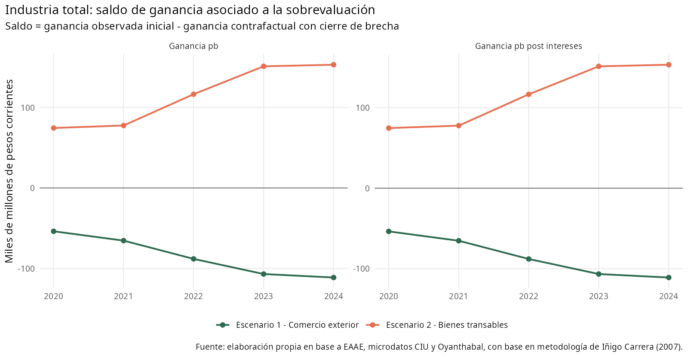
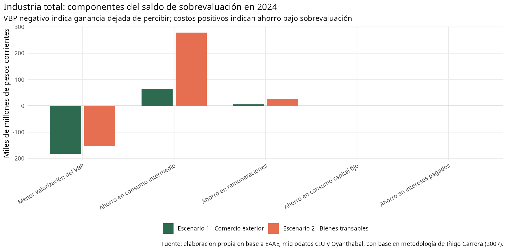
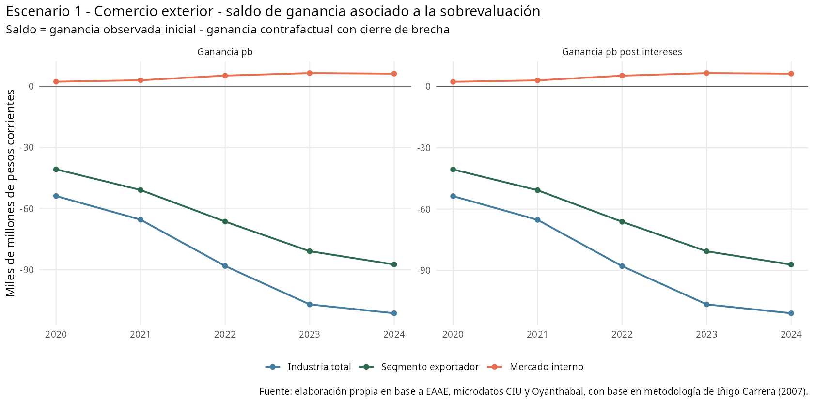
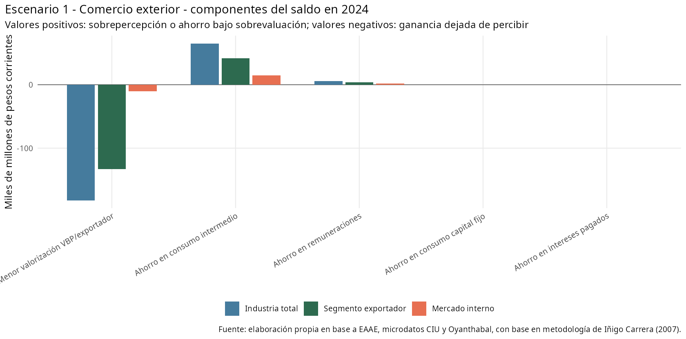
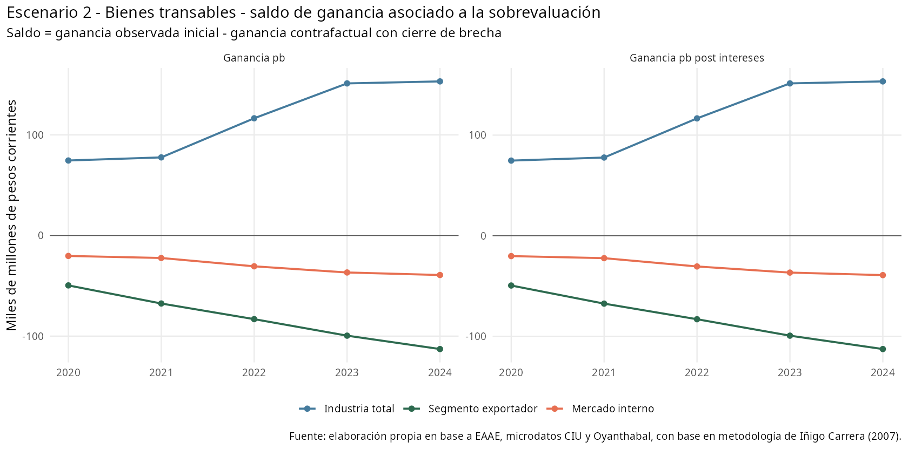
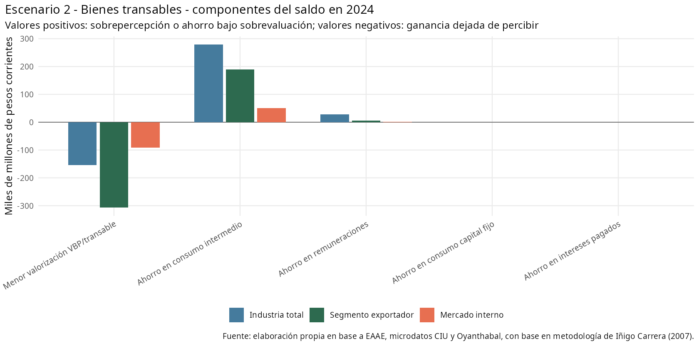

# Saldos de ganancia asociados a la sobrevaluación cambiaria industrial, 2020-2024

Fuente de trabajo: `data/analysis-data/20260828_panel_eaae_2020_2024_industria_escenario_devaluacion.xlsx`, hojas `escenario-inicial`, `Escenario 1 - Comercio Exterior` y `Escenario 2 - Bienes Transables`.

Esta minuta integra los dos ejercicios de cierre de brecha cambiaria construidos para la industria manufacturera uruguaya. A diferencia de la lectura centrada en el resultado contrafactual de devaluación, aquí el foco está puesto en el saldo monetario que se observa desde el escenario inicial de sobrevaluación.

La convención de signo es `ganancia inicial - ganancia contrafactual con cierre de brecha`. Por eso, un valor negativo indica ganancia dejada de percibir bajo sobrevaluación: si se cerrara la brecha cambiaria, la masa de ganancia sería mayor. Un valor positivo indica ganancia sobrepercibida bajo sobrevaluación: si se cerrara la brecha, la masa de ganancia sería menor. Las magnitudes se presentan en miles de millones de pesos corrientes.

La medida principal es la masa de ganancia a precios básicos `ganancia_pb`. Como complemento se reporta `ganancia_pb_desp_intereses`, que descuenta intereses pagados y permite observar si el saldo se mantiene una vez considerado el canal financiero. No se presentan tasas de ganancia en esta versión de la minuta.

## 1. Industria general: saldos comparados entre escenarios

A nivel de industria total, los dos escenarios producen saldos opuestos. En el escenario de comercio exterior, el cierre de la brecha elevaría la ganancia industrial; por tanto, desde la posición inicial de sobrevaluación aparece un saldo negativo: ganancia dejada de percibir. En el escenario de bienes transables, el cierre de la brecha reduce la ganancia agregada por el mayor peso de consumo intermedio y masa salarial; desde la posición inicial, eso aparece como saldo positivo: ganancia sobrepercibida bajo sobrevaluación.



| Escenario | Ganancia base prom. | Ganancia escenario prom. | Saldo sobrevaluación prom. | Saldo post intereses prom. | Ganancia base 2024 | Ganancia escenario 2024 | Saldo 2024 | Saldo post intereses 2024 |
| --- | --- | --- | --- | --- | --- | --- | --- | --- |
| Escenario 2 - Bienes transables | 83,4 | -31,2 | +114,6 | +114,8 | 78,2 | -75,0 | +153,2 | +153,4 |
| Escenario 1 - Comercio exterior | 83,4 | 168,5 | -85,1 | -84,9 | 78,2 | 189,4 | -111,3 | -111,0 |

La descomposición de 2024 muestra el mecanismo. La menor valorización del VBP aparece con signo negativo porque representa ganancia dejada de percibir bajo sobrevaluación. Los menores costos observados bajo sobrevaluación aparecen con signo positivo porque elevan la ganancia inicial respecto del contrafactual de paridad.



| Componente | Escenario 1 | Escenario 2 |
| --- | --- | --- |
| Menor valorización del VBP | -182,1 | -153,5 |
| Ahorro en consumo intermedio | +64,9 | +278,9 |
| Ahorro en remuneraciones | +5,6 | +27,5 |
| Ahorro en consumo capital fijo | +0,3 | +0,3 |
| Ahorro en intereses pagados | +0,3 | +0,3 |

## 2. Escenario 1 - Comercio Exterior

La apropiación de riqueza vía sobrevaluación de la moneda se aplica a los componentes importados de costos y capital y a la parte exportada de la producción. Por tanto, recoge el efecto directo de importaciones y exportaciones sobre la masa de ganancia.

En este escenario, la sobrevaluación comprime la valorización en pesos del VBP asociado al comercio exterior y, al mismo tiempo, abarata componentes importados de costos y capital. El balance de esos canales se expresa como saldo de masa de ganancia observado desde el escenario inicial.

En 2024, la industria total registra un saldo de sobrevaluación de -111,3 miles de millones de pesos corrientes en ganancia a precios básicos.
En el mismo año, el segmento exportador registra -87,4 y el segmento mercado interno registra +6,2 miles de millones.



| Sección | Ganancia base prom. | Ganancia escenario prom. | Saldo sobrevaluación prom. | Saldo post intereses prom. | Ganancia base 2024 | Ganancia escenario 2024 | Saldo 2024 | Saldo post intereses 2024 |
| --- | --- | --- | --- | --- | --- | --- | --- | --- |
| Segmento exportador | 59,8 | 125,0 | -65,2 | -65,1 | 66,2 | 153,6 | -87,4 | -87,2 |
| Industria total | 83,4 | 168,5 | -85,1 | -84,9 | 78,2 | 189,4 | -111,3 | -111,0 |
| Mercado interno | 20,2 | 15,6 | +4,6 | +4,7 | 20,3 | 14,2 | +6,2 | +6,2 |



Coeficientes que inciden en la masa de ganancia:

| Sección | Variable afectada | Incidencia |
| --- | --- | --- |
| Industria total | Consumo capital fijo | 1,7% |
| Industria total | Consumo intermedio | 18,9% |
| Industria total | Intereses pagados | 8,5% |
| Industria total | Masa salarial | 9,3% |
| Industria total | VBP/exportador | 39,5% |
| Mercado interno | Consumo capital fijo | 1,1% |
| Mercado interno | Consumo intermedio | 22,7% |
| Mercado interno | Intereses pagados | 8,5% |
| Mercado interno | Masa salarial | 9,3% |
| Mercado interno | VBP/exportador | 10,7% |
| Segmento exportador | Consumo capital fijo | 0,8% |
| Segmento exportador | Consumo intermedio | 18,1% |
| Segmento exportador | Intereses pagados | 8,5% |
| Segmento exportador | Masa salarial | 9,3% |
| Segmento exportador | VBP/exportador | 42,0% |

## 3. Escenario 2 - Bienes Transables

La apropiación de riqueza vía sobrevaluación alcanza al conjunto de mercancías cuyos precios internos se rigen por precios internacionales, aunque sean producidas localmente y vendidas en el mercado interno. Así, incorpora la revaluación de producción local transable y su efecto sobre la masa de ganancia.

En este escenario, la incidencia no queda limitada al comercio exterior directo. También se consideran mercancías producidas localmente cuyos precios internos se rigen por precios internacionales. Esto amplía tanto los canales positivos del VBP como los canales de costos, por lo que la lectura debe concentrarse en el saldo neto de masa de ganancia.

En 2024, la industria total registra un saldo de sobrevaluación de +153,2 miles de millones de pesos corrientes en ganancia a precios básicos.
En el mismo año, el segmento exportador registra -112,8 y el segmento mercado interno registra -39,3 miles de millones.



| Sección | Ganancia base prom. | Ganancia escenario prom. | Saldo sobrevaluación prom. | Saldo post intereses prom. | Ganancia base 2024 | Ganancia escenario 2024 | Saldo 2024 | Saldo post intereses 2024 |
| --- | --- | --- | --- | --- | --- | --- | --- | --- |
| Segmento exportador | 59,8 | 142,3 | -82,5 | -82,4 | 66,2 | 179,0 | -112,8 | -112,7 |
| Industria total | 83,4 | -31,2 | +114,6 | +114,8 | 78,2 | -75,0 | +153,2 | +153,4 |
| Mercado interno | 20,2 | 50,1 | -29,9 | -29,8 | 20,3 | 59,6 | -39,3 | -39,2 |



Coeficientes que inciden en la masa de ganancia:

| Sección | Variable afectada | Incidencia |
| --- | --- | --- |
| Industria total | Consumo capital fijo | 1,7% |
| Industria total | Consumo intermedio | 81,2% |
| Industria total | Intereses pagados | 8,5% |
| Industria total | Masa salarial | 45,3% |
| Industria total | VBP/transable | 33,3% |
| Mercado interno | Consumo capital fijo | 1,1% |
| Mercado interno | Consumo intermedio | 76,4% |
| Mercado interno | Intereses pagados | 8,5% |
| Mercado interno | Masa salarial | 8,3% |
| Mercado interno | VBP/transable | 92,4% |
| Segmento exportador | Consumo capital fijo | 0,8% |
| Segmento exportador | Consumo intermedio | 82,0% |
| Segmento exportador | Intereses pagados | 8,5% |
| Segmento exportador | Masa salarial | 13,3% |
| Segmento exportador | VBP/transable | 97,2% |

## Nota técnica

La fórmula común aplicada en ambos escenarios es:

```text
factor_devaluacion = tipo_cambio_paridad_pesos_usd / tipo_cambio_comercial_pesos_usd - 1
delta_variable = variable_base * incidencia_seccion_variable * factor_devaluacion
ganancia_pb_escenario = ganancia_pb + delta_vbp_pp - delta_consumo_intermedio_estimado - delta_remuneraciones - delta_consumo_capital_fijo
saldo_sobrevaluacion_ganancia_pb = ganancia_pb - ganancia_pb_escenario
ganancia_pb_desp_intereses_escenario = ganancia_pb_escenario - intereses_industria_pesos_escenario
saldo_sobrevaluacion_ganancia_pb_desp_intereses = ganancia_pb_desp_intereses - ganancia_pb_desp_intereses_escenario
```

El coeficiente de stock de capital imputado se mantiene en el XLSX porque afecta cálculos de tasa de ganancia, pero no se presenta en esta minuta porque la medida solicitada es masa absoluta de ganancia. Por esa razón, las figuras y tablas de componentes de esta versión usan VBP, consumo intermedio, remuneraciones, consumo de capital fijo e intereses.
