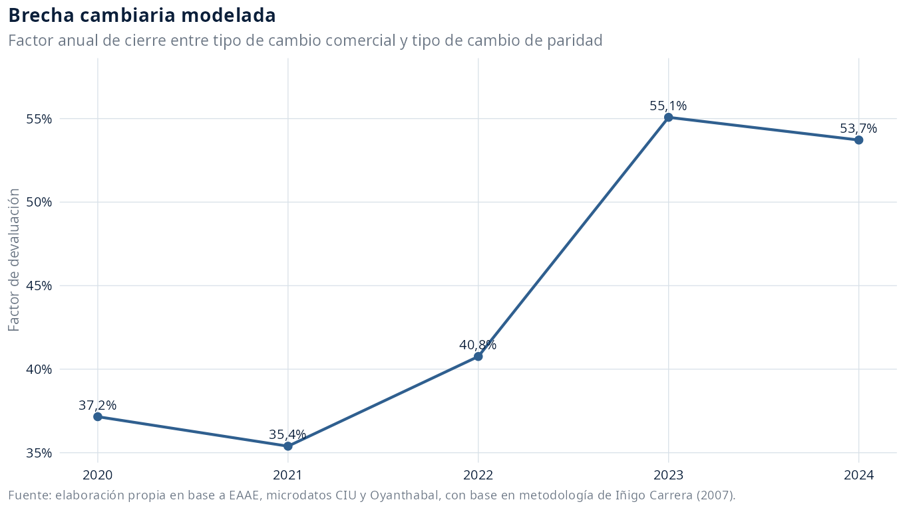
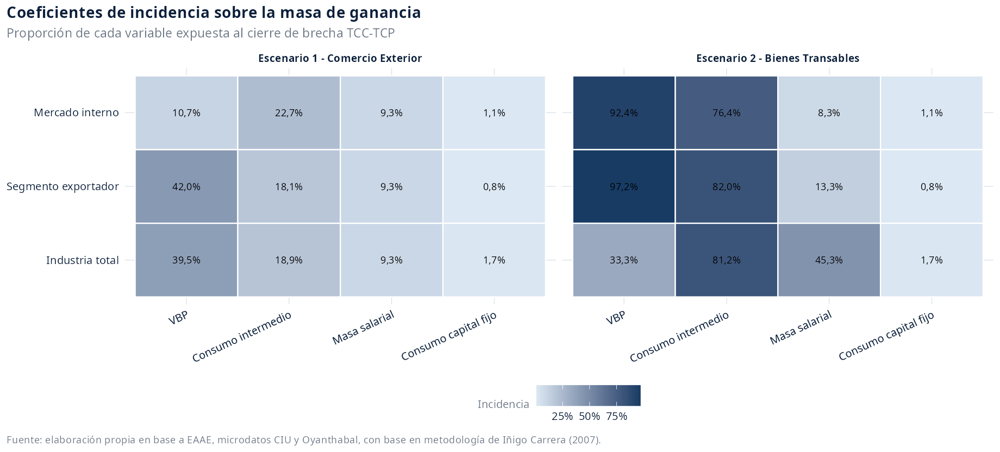
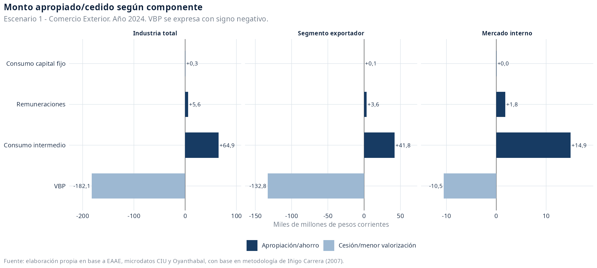
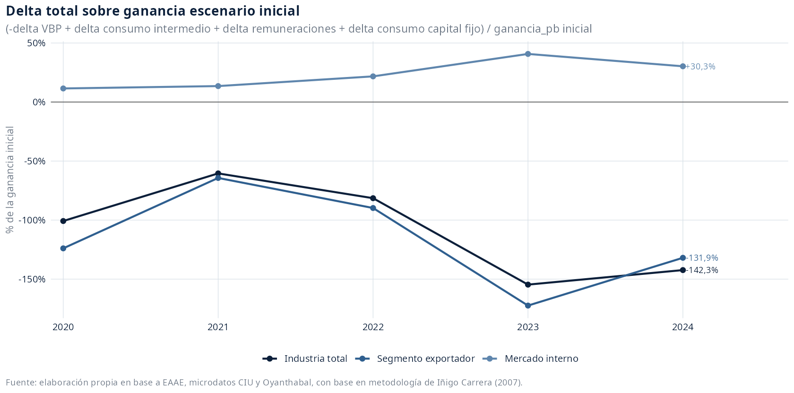
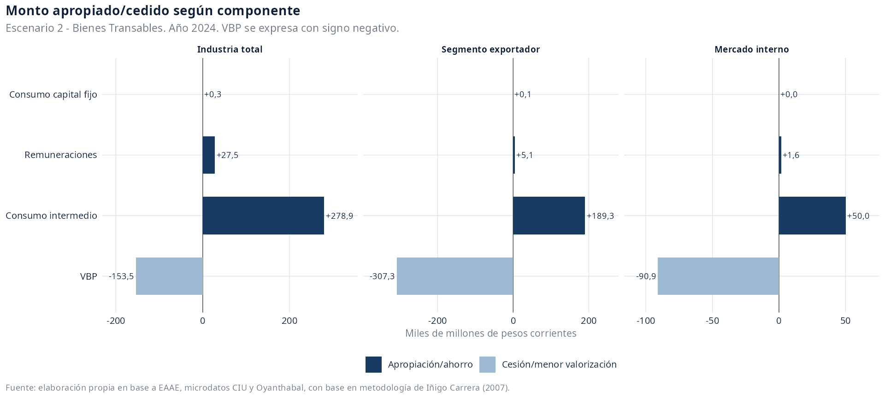
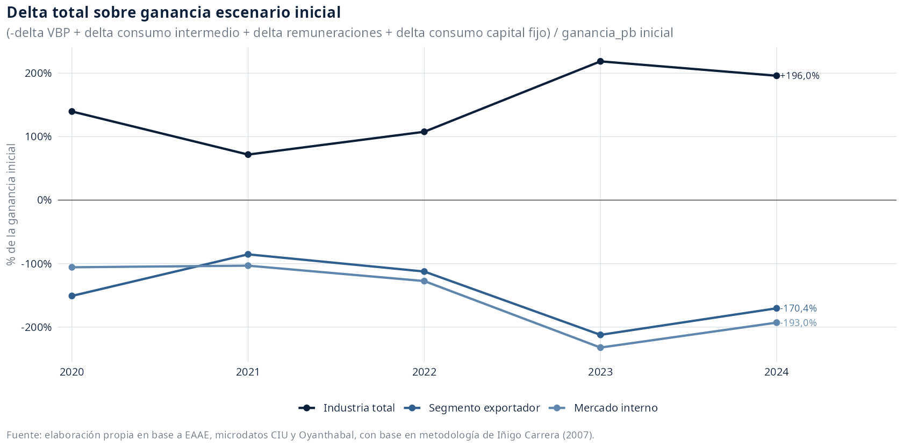

# Escenarios integrados: deltas de masa de ganancia asociados a la sobrevaluación cambiaria industrial

Fuente de trabajo: `data/analysis-data/20260831_panel_eaae_2020_2024_industria_escenario_devaluacion.xlsx`, hojas `escenario-inicial`, `tipo-cambio`, `Escenario 1 - Comercio Exterior` y `Escenario 2 - Bienes Transables`.

## Introducción

Esta minuta actualiza la lectura de los escenarios de cierre de brecha cambiaria para la industria manufacturera uruguaya a partir del XLSX regenerado con prefijo 20260831. La unidad de análisis son tres secciones: industria total, segmento exportador y segmento orientado al mercado interno. El ejercicio se expresa en valores corrientes y se concentra en la masa de ganancia a precios básicos, no en tasas de ganancia.

El primer escenario recoge la incidencia directa del comercio exterior. El segundo amplía el ejercicio hacia bienes transables cuyos precios internos se rigen por precios internacionales. En ambos casos, el cálculo se realiza año a año, sin efectos acumulados ni respuestas dinámicas de cantidades, productividad o estructura productiva.

## Supuestos y fuentes

Las fuentes usadas son: EAAE para VBP, VAB, remuneraciones, consumo intermedio estimado y consumo de capital fijo; Oyanthabal, con base en la metodología de Iñigo Carrera (2007), para los tipos de cambio comercial y de paridad; microdatos del CIU para distribuir intereses industriales en el XLSX fuente; y la clasificación operativa de subramas industriales 2020-2024 para separar industria exportadora, mercado interno y combustible. Esta minuta no reporta tasas de ganancia ni efectos sobre stock o intereses.

Se trabaja desde 2020 porque en ese tramo la fuente opera con ramas homogéneas. Extender el ejercicio al panel completo exigiría procesar distintas versiones CIIU, lo que vuelve incompatible diferenciar con criterio uniforme el segmento industrial exportador y el segmento orientado al mercado interno.

Ramas incluidas en el segmento exportador:
- 10: Elaboración de productos alimenticios
- 11 y 12: Elaboración de bebidas y elaboración de productos de tabaco
- 13: Fabricación de productos textiles
- 15: Fabricación de cueros y productos conexos
- 16: Producción de madera y fabricación de productos de madera y corcho, excepto muebles
- 17: Fabricación de papel y de los productos de papel
- 22: Fabricación de productos de caucho y plástico

Ramas incluidas en el segmento mercado interno:
- 14: Fabricación de prendas de vestir
- 18: Actividades de impresión y reproducción de grabaciones
- 20: Fabricación de sustancias y productos químicos
- 21: Fabricación de productos farmacéuticos, sustancias químicas medicinales y de productos botánicos
- 23: Fabricación de otros productos minerales no metálicos
- 24: Fabricación de metales comunes
- 25: Fabricación de productos derivados del metal, excepto maquinaria y equipo
- 26 y 27: Fabricación de productos informáticos, electrónicos y ópticos; fabricación de equipo eléctrico
- 28: Fabricación de maquinaria y equipo n.c.p
- 29 y 30: Fabricación de vehículos automotores, remolques y semirremolques; fabricación de otros tipos de equipo de transporte
- 31: Fabricación de muebles
- 32: Otras industrias manufactureras
- 33: Reparación e instalación de la maquinaria y equipo



El factor de devaluación considerado se calcula como `tipo_cambio_paridad_pesos_usd / tipo_cambio_comercial_pesos_usd - 1`. En 2020-2024, el promedio es 44,4%, con mínimo de 35,4% y máximo de 55,1%.

| Año | Tipo de cambio comercial | Tipo de cambio paridad | Factor de devaluación |
| --- | --- | --- | --- |
| 2020 | 42,00 | 57,61 | 37,2% |
| 2021 | 43,56 | 58,98 | 35,4% |
| 2022 | 41,30 | 58,13 | 40,8% |
| 2023 | 38,70 | 60,01 | 55,1% |
| 2024 | 40,24 | 61,85 | 53,7% |

## Coeficientes de incidencia

La minuta usa cuatro coeficientes de incidencia para construir la masa de ganancia: VBP, consumo intermedio, remuneraciones y consumo de capital fijo. Para los gráficos de componentes, VBP se expresa con signo negativo; los demás deltas se expresan con signo positivo. Por tanto, el delta total es `-delta_vbp_pp + delta_consumo_intermedio_estimado + delta_remuneraciones + delta_consumo_capital_fijo`.



| Escenario | Sección | Variable | Incidencia | Efecto | Fuente |
| --- | --- | --- | --- | --- | --- |
| Escenario 1 - Comercio Exterior | Industria total | Consumo capital fijo | 1,7% | Negativo | hoja Modelo; bloque V.1 \| Cantidades fijas \| Importado; Efecto de inversión importada, prorrateada por depreciación lineal estimació... |
| Escenario 1 - Comercio Exterior | Industria total | Consumo intermedio | 18,9% | Negativo | hoja Modelo; bloque V.1 \| Cantidades fijas \| Importado; Se toma COU porque incluye impuestos y márgenes de comercio y transporte, pr... |
| Escenario 1 - Comercio Exterior | Industria total | Masa salarial | 9,3% | Negativo | hoja Modelo; bloque V.1 \| Cantidades fijas \| Importado; Se toma COU porque incluye impuestos y márgenes de comercio y transporte, pr... |
| Escenario 1 - Comercio Exterior | Industria total | VBP | 39,5% | Positivo | hoja Modelo; bloque V.1 \| Cantidades fijas \| Importado; Exportaciones CCNN, con factor de microdatos, respecto de VBP EAAE, promedio... |
| Escenario 1 - Comercio Exterior | Mercado interno | Consumo capital fijo | 1,1% | Negativo | hoja Impo_Expo - Mercado Interno; bloque Mercado interno |
| Escenario 1 - Comercio Exterior | Mercado interno | Consumo intermedio | 22,7% | Negativo | hoja Impo_Expo - Mercado Interno; bloque Mercado interno |
| Escenario 1 - Comercio Exterior | Mercado interno | Masa salarial | 9,3% | Negativo | hoja Impo_Expo - Mercado Interno; bloque Mercado interno |
| Escenario 1 - Comercio Exterior | Mercado interno | VBP | 10,7% | Positivo | hoja Impo_Expo - Mercado Interno; bloque Mercado interno |
| Escenario 1 - Comercio Exterior | Segmento exportador | Consumo capital fijo | 0,8% | Negativo | hoja Impo_Expo - Mercado Interno; bloque Exportadores |
| Escenario 1 - Comercio Exterior | Segmento exportador | Consumo intermedio | 18,1% | Negativo | hoja Impo_Expo - Mercado Interno; bloque Exportadores |
| Escenario 1 - Comercio Exterior | Segmento exportador | Masa salarial | 9,3% | Negativo | hoja Impo_Expo - Mercado Interno; bloque Exportadores |
| Escenario 1 - Comercio Exterior | Segmento exportador | VBP | 42,0% | Positivo | hoja Impo_Expo - Mercado Interno; bloque Exportadores |
| Escenario 2 - Bienes Transables | Industria total | Consumo capital fijo | 1,7% | Negativo | hoja Modelo; bloque V.2 \| Cantidades fijas \| Transable |
| Escenario 2 - Bienes Transables | Industria total | Consumo intermedio | 81,2% | Negativo | hoja Modelo; bloque V.2 \| Cantidades fijas \| Transable; Se toma COU porque incluye impuestos y márgenes de comercio y transporte, pr... |
| Escenario 2 - Bienes Transables | Industria total | Masa salarial | 45,3% | Negativo | hoja Modelo; bloque V.2 \| Cantidades fijas \| Transable; Se toma COU porque incluye impuestos y márgenes de comercio y transporte, pr... |
| Escenario 2 - Bienes Transables | Industria total | VBP | 33,3% | Positivo | hoja Modelo; bloque V.2 \| Cantidades fijas \| Transable; Exportaciones CCNN, con factor de microdatos, respecto de VBP EAAE, promedio... |
| Escenario 2 - Bienes Transables | Mercado interno | Consumo capital fijo | 1,1% | Negativo | hoja Transable_Expo - MI; bloque Mercado interno |
| Escenario 2 - Bienes Transables | Mercado interno | Consumo intermedio | 76,4% | Negativo | hoja Transable_Expo - MI; bloque Mercado interno |
| Escenario 2 - Bienes Transables | Mercado interno | Masa salarial | 8,3% | Negativo | hoja Transable_Expo - MI; bloque Mercado interno |
| Escenario 2 - Bienes Transables | Mercado interno | VBP | 92,4% | Positivo | hoja Transable_Expo - MI; bloque Mercado interno |
| Escenario 2 - Bienes Transables | Segmento exportador | Consumo capital fijo | 0,8% | Negativo | hoja Transable_Expo - MI; bloque Exportadores |
| Escenario 2 - Bienes Transables | Segmento exportador | Consumo intermedio | 82,0% | Negativo | hoja Transable_Expo - MI; bloque Exportadores |
| Escenario 2 - Bienes Transables | Segmento exportador | Masa salarial | 13,3% | Negativo | hoja Transable_Expo - MI; bloque Exportadores |
| Escenario 2 - Bienes Transables | Segmento exportador | VBP | 97,2% | Positivo | hoja Transable_Expo - MI; bloque Exportadores |

## 1. Escenario 1 - Comercio Exterior

La apropiación de riqueza vía sobrevaluación de la moneda se aplica a los componentes importados de costos y capital y a la parte exportada de la producción. Por tanto, recoge el efecto directo de importaciones y exportaciones sobre la masa de ganancia.

El primer gráfico muestra, para el último año disponible, el monto apropiado o cedido por componente en cada sección. El segundo resume el efecto neto anual como porcentaje de la ganancia a precios básicos del escenario inicial.





## 2. Escenario 2 - Bienes Transables

La apropiación de riqueza vía sobrevaluación alcanza al conjunto de mercancías cuyos precios internos se rigen por precios internacionales, aunque sean producidas localmente y vendidas en el mercado interno. Así, incorpora la revaluación de producción local transable y su efecto sobre la masa de ganancia.

El primer gráfico muestra, para el último año disponible, el monto apropiado o cedido por componente en cada sección. El segundo resume el efecto neto anual como porcentaje de la ganancia a precios básicos del escenario inicial.





## Síntesis cuantitativa

La tabla resume el último año disponible (2024). Los montos están expresados en miles de millones de pesos corrientes.

| Escenario | Sección | Delta total / ganancia inicial | Delta total | Ganancia inicial | Ganancia escenario |
| --- | --- | --- | --- | --- | --- |
| Escenario 1 - Comercio Exterior | Industria total | -142,3% | -111,3 | 78,2 | -33,1 |
| Escenario 1 - Comercio Exterior | Mercado interno | 30,3% | +6,2 | 20,3 | 26,5 |
| Escenario 1 - Comercio Exterior | Segmento exportador | -131,9% | -87,4 | 66,2 | -21,1 |
| Escenario 2 - Bienes Transables | Industria total | 196,0% | +153,2 | 78,2 | 231,3 |
| Escenario 2 - Bienes Transables | Mercado interno | -193,0% | -39,3 | 20,3 | -18,9 |
| Escenario 2 - Bienes Transables | Segmento exportador | -170,4% | -112,8 | 66,2 | -46,6 |

## Anexo técnico

La fórmula común aplicada en ambos escenarios es:

```text
factor_devaluacion = tipo_cambio_paridad_pesos_usd / tipo_cambio_comercial_pesos_usd - 1
delta_variable = variable_base * incidencia_seccion_variable * factor_devaluacion
delta_total_ganancia_pb = -delta_vbp_pp + delta_consumo_intermedio_estimado + delta_remuneraciones + delta_consumo_capital_fijo
ganancia_pb_devaluacion = ganancia_pb + delta_total_ganancia_pb
delta_total_sobre_ganancia_inicial = delta_total_ganancia_pb / ganancia_pb * 100
```

El XLSX fuente mantiene otros campos para trazabilidad del modelo, pero esta minuta se restringe a la masa de ganancia a precios básicos y a los cuatro deltas solicitados. No se calculan ni reportan tasas de ganancia.
