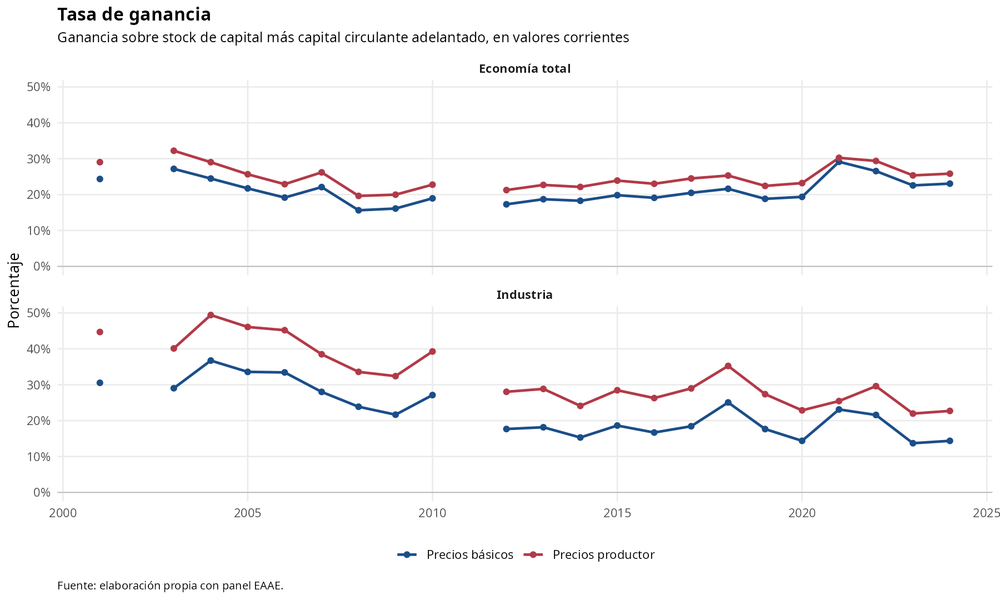
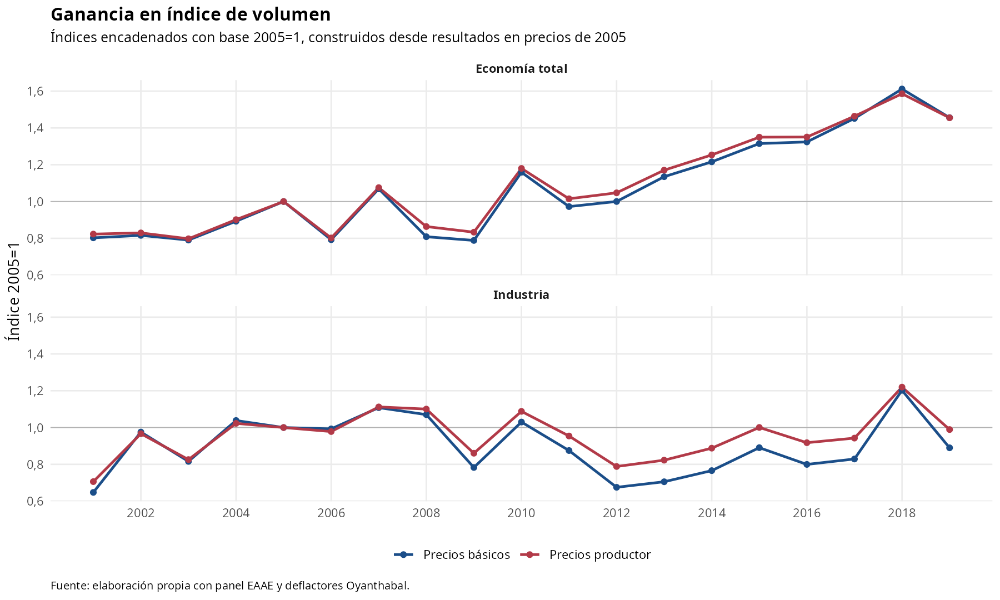
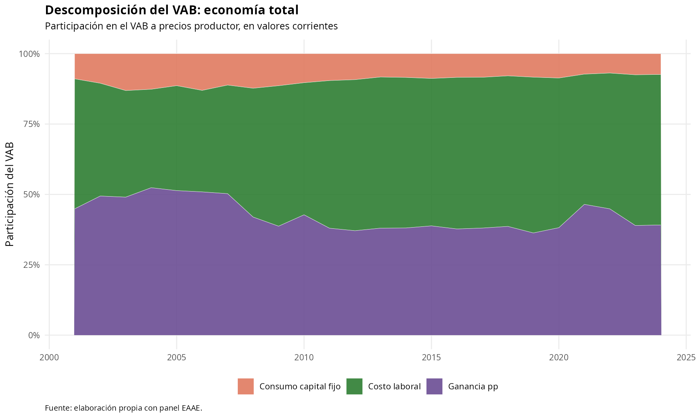
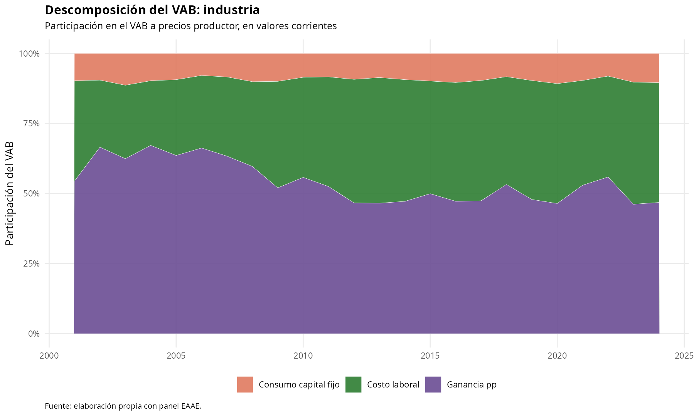
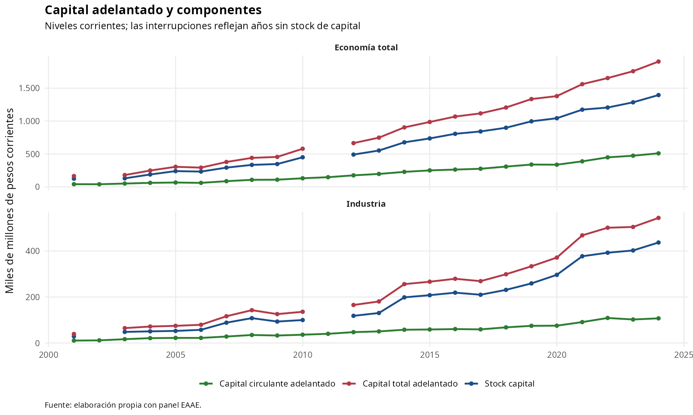
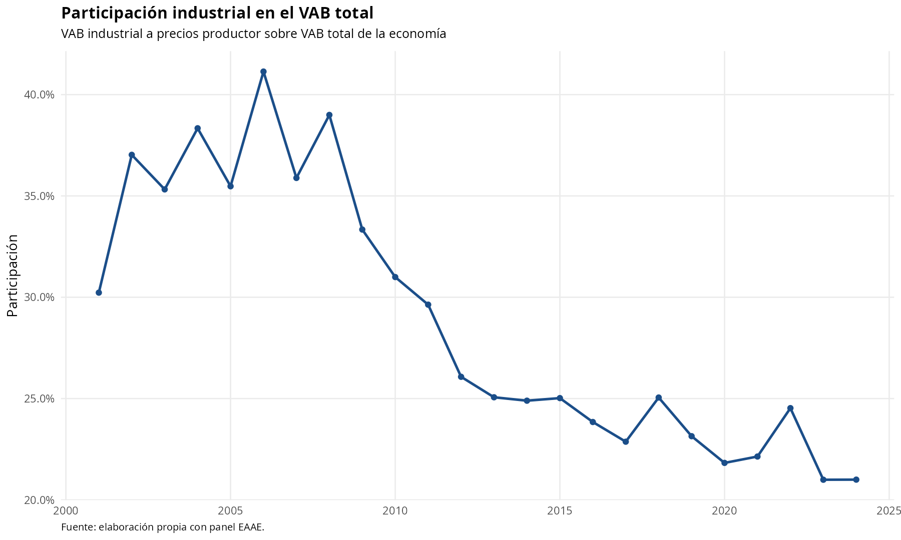

# Resultados visuales EAAE

Fuente de datos: `data/analysis-data/20260603_panel_eaae.xlsx`.

Este informe resume visualmente los resultados propios calculados para la economía total y la rama industrial. Las figuras se generan con `command-files/analysis-command-files/03_visualizar_resultados_eaae.R` y se guardan como PNG para que GitHub las muestre directamente.

## Criterios de lectura

- Las tasas de ganancia, la descomposición del VAB, el capital adelantado y la participación industrial se muestran en valores corrientes para conservar la cobertura hasta 2024.
- Las ganancias indexadas usan las hojas de resultados en precios constantes y se expresan con base 2005=1.
- Las series en precios constantes e índices dependen del `gdp_price_index_base_2005`, disponible hasta 2019; por eso esas figuras no fuerzan continuidad después de ese año.
- Las interrupciones en capital adelantado reflejan años sin `stock_capital` en el panel.

## Figuras

### 1. Tasa de ganancia

La tasa se calcula como ganancia sobre `stock_capital + capital_circulante_adelantado`. Se presentan las variantes a precios básicos y a precios productor.



### 2. Ganancia en índice 2005=1

Compara la dinámica real de la ganancia a precios básicos y productor. La base común facilita comparar economía total e industria aunque sus niveles difieran.



### 3. Descomposición del VAB: economía total

Distribuye el VAB a precios productor entre costo laboral, consumo de capital fijo y ganancia a precios productor.



### 4. Descomposición del VAB: industria

Replica la misma descomposición para la rama industrial, permitiendo evaluar si su estructura difiere de la economía total.



### 5. Capital adelantado y componentes

Muestra el stock de capital, el capital circulante adelantado y el capital total adelantado. Las escalas se separan por ámbito para no ocultar la dinámica industrial.



### 6. Participación industrial en el VAB total

Mide el peso de la industria manufacturera dentro del VAB total de la economía.



## Reproducción

Desde la raíz del repositorio:

```bash
Rscript command-files/analysis-command-files/03_visualizar_resultados_eaae.R
```
