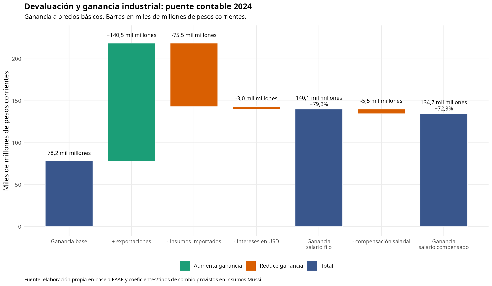
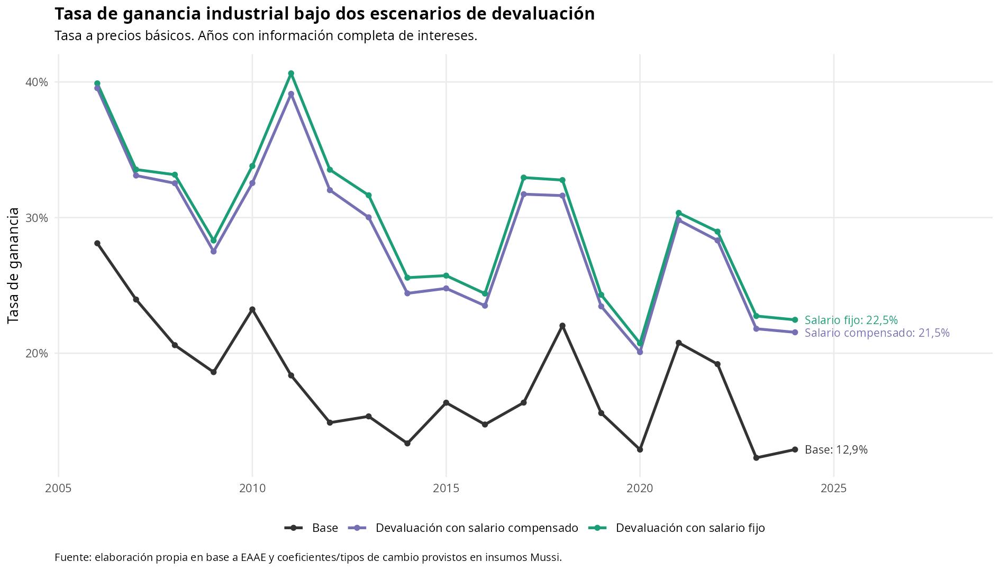
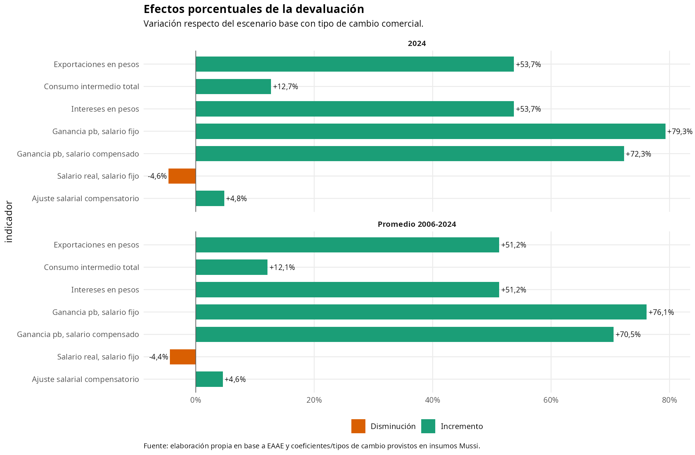

# Resultados de devaluación para el sector industrial

Fuente de trabajo: `data/analysis-data/20260817_resultados_eaae_bcu_total_industria_subrama.xlsx`, hoja `efecto-devaluacion-corrientes`.

Esta minuta presenta una lectura sintética de las consecuencias contables de aplicar una devaluación sobre la industria manufacturera total. El ejercicio compara el tipo de cambio comercial con el tipo de cambio de paridad y mantiene constantes las cantidades producidas, la estructura exportadora y los coeficientes técnicos. Por lo tanto, no debe leerse como una predicción macroeconómica, sino como una simulación parcial de redistribución de ingresos y costos ante un cambio cambiario.

La idea central es simple: la devaluación no impacta igual a quienes venden en dólares, compran insumos importados, pagan intereses en dólares o viven de un salario en pesos. En el sector industrial, el capital exportador recibe más pesos por sus ventas externas; al mismo tiempo, suben los costos de la parte importada del consumo intermedio y los intereses denominados en dólares. Para los trabajadores, el resultado depende de la política salarial: si los salarios nominales quedan fijos, cae el poder de compra; si se compensan, se protege el salario real y se reduce parte de la mejora de la ganancia capitalista.

## Escenarios evaluados

- **Escenario base:** valores corrientes observados con tipo de cambio comercial.
- **Devaluación con salario nominal fijo:** las exportaciones, los insumos importados y los intereses en dólares se reexpresan al tipo de cambio de paridad, pero las remuneraciones nominales no se ajustan. Este escenario maximiza el traslado distributivo hacia la ganancia industrial.
- **Devaluación con salario compensado:** se aplica el mismo cambio de tipo de cambio, pero las remuneraciones aumentan según la proporción importada del consumo obrero. Este escenario preserva el poder de compra asociado a esa canasta importada y reduce la ganancia adicional del capital.

## Resultados principales

|Período   |TC paridad vs comercial |Exportaciones en pesos |Consumo intermedio total |Intereses en pesos |Salario real con salario fijo |Ganancia pb, salario fijo |Ganancia pb, salario compensado |Tasa ganancia pb, salario fijo |Tasa ganancia pb, salario compensado |
|:---------|:-----------------------|:----------------------|:------------------------|:------------------|:-----------------------------|:-------------------------|:-------------------------------|:------------------------------|:------------------------------------|
|2006-2024 |51,2%                   |51,2%                  |12,1%                    |51,2%              |-4,4%                         |76,1%                     |70,5%                           |+11,9 p.p. / +70,0%            |+10,9 p.p. / +64,3%                  |
|2024      |53,7%                   |53,7%                  |12,7%                    |53,7%              |-4,6%                         |79,3%                     |72,3%                           |+9,6 p.p. / +74,1%             |+8,6 p.p. / +67,0%                   |

En 2024, el tipo de cambio de paridad queda 53,7% por encima del tipo de cambio comercial. Esto eleva las exportaciones industriales en pesos en la misma proporción. El efecto positivo no se traslada íntegro a la ganancia, porque el consumo intermedio total aumenta 12,7% y los intereses en pesos aumentan 53,7%.

Aun descontando esos costos, la ganancia a precios básicos sube 79,3% si el salario nominal queda fijo. En ese caso, la tasa de ganancia pasa de 12,9% a 22,5%, un incremento de 9,6 puntos porcentuales. Para los trabajadores, la contracara es una pérdida de salario real de 4,6%.

Si las remuneraciones se compensan para sostener el poder de compra de la canasta obrera importada, la ganancia industrial igualmente aumenta, pero menos: 72,3%. La tasa de ganancia queda en 21,5%, equivalente a un aumento de 8,6 puntos porcentuales frente al escenario base. Esta diferencia entre escenarios resume el conflicto distributivo directo del ejercicio: cuanto más absorbe el salario la devaluación, mayor es la mejora de la ganancia; cuanto más se compensa el salario, menor es esa transferencia.

## 1. Puente contable de la ganancia

El primer gráfico muestra cómo se pasa desde la ganancia base hasta la ganancia bajo devaluación. La barra positiva de exportaciones representa el ingreso adicional en pesos. Luego se descuentan el encarecimiento de insumos importados y de intereses en dólares. El escenario de salario compensado incorpora un descuento adicional: la recomposición salarial necesaria para preservar el poder de compra de la parte importada de la canasta obrera.



## 2. Tasa de ganancia en los dos escenarios

La tasa de ganancia se calcula a precios básicos. La comparación muestra que ambos escenarios elevan la tasa respecto del escenario base, pero el escenario de salario fijo genera una tasa superior porque la pérdida real del salario queda capturada como mayor excedente capitalista.



## 3. Impactos porcentuales

El tercer gráfico resume las variaciones porcentuales. Para facilitar la lectura, el salario real bajo salario nominal fijo se grafica como disminución, mientras que la compensación salarial aparece como el aumento nominal necesario para neutralizar esa pérdida sobre la canasta importada.



## Calidad y cobertura

|Control                                          |Resultado |
|:------------------------------------------------|:---------|
|Filas de la hoja                                 |24        |
|Cobertura                                        |2001-2024 |
|Años completos con intereses                     |19        |
|Años parciales sin intereses                     |5         |
|Faltantes en TC comercial                        |0         |
|Faltantes en TC paridad                          |0         |
|Faltantes en exportaciones                       |0         |
|Faltantes en proporción importada CI             |0         |
|Faltantes en proporción consumo obrero importado |0         |

Los años 2001-2005 quedan disponibles sólo para componentes no financieros, porque la fuente de intereses industriales comienza en 2006. Por esa razón, la interpretación principal de esta minuta se concentra en 2006-2024, período con información completa de intereses.

## Anexo técnico

### Tipo de cambio

El factor de devaluación compara el tipo de cambio de paridad contra el tipo de cambio comercial:

```text
factor_devaluacion = tipo_cambio_paridad_pesos_usd / tipo_cambio_comercial_pesos_usd
```

### Exportaciones

Las exportaciones industriales se toman en miles de dólares, corregidas al 95% para aproximar el universo EAAE. Se convierten a pesos con ambos tipos de cambio. El efecto de devaluación es la diferencia entre el valor a tipo de cambio de paridad y el valor a tipo de cambio comercial:

```text
exportaciones_tcc_pesos = exportaciones_manufactura_eaae_95_miles_usd * tipo_cambio_comercial_pesos_usd * 1000
exportaciones_tcp_pesos = exportaciones_manufactura_eaae_95_miles_usd * tipo_cambio_paridad_pesos_usd * 1000
efecto_exportaciones_pesos = exportaciones_tcp_pesos - exportaciones_tcc_pesos
```

### Consumo intermedio

El consumo intermedio no se revaloriza completo, sino sólo en la proporción estimada como importada. La parte nacional se mantiene sin cambio en esta simulación:

```text
consumo_intermedio_importado_pesos = consumo_intermedio * prop_importado_consumo_intermedio
consumo_intermedio_devaluacion_pesos =
  consumo_intermedio_no_importado + consumo_intermedio_importado_pesos * factor_devaluacion
efecto_consumo_intermedio_pesos = consumo_intermedio_devaluacion_pesos - consumo_intermedio
```

### Intereses pagados

Los intereses industriales se toman en millones de dólares. La simulación compara su costo en pesos al tipo de cambio comercial y al tipo de cambio de paridad:

```text
intereses_tcc_pesos = intereses_industria_eaae_ajuste_90_mill_usd * tipo_cambio_comercial_pesos_usd * 1000000
intereses_tcp_pesos = intereses_industria_eaae_ajuste_90_mill_usd * tipo_cambio_paridad_pesos_usd * 1000000
efecto_intereses_pesos = intereses_tcp_pesos - intereses_tcc_pesos
```

### Remuneraciones

Para el escenario de salario fijo, las remuneraciones nominales no cambian y la pérdida se expresa como caída del poder de compra sobre la parte importada de la canasta obrera. Para el escenario compensado, las remuneraciones suben según el factor de encarecimiento de esa canasta:

```text
factor_canasta_obrera =
  (1 - prop_consumo_obrero_importado) +
  prop_consumo_obrero_importado * factor_devaluacion

remuneraciones_reales_post_devaluacion = remuneraciones / factor_canasta_obrera
perdida_salarial_real_pesos = remuneraciones - remuneraciones_reales_post_devaluacion

remuneraciones_compensadas_devaluacion = remuneraciones * factor_canasta_obrera
efecto_salario_compensado_pesos = remuneraciones_compensadas_devaluacion - remuneraciones
```

### Ganancia y tasa de ganancia

La ganancia con salario fijo suma el efecto neto de la devaluación sobre exportaciones y resta el mayor costo de insumos importados e intereses. La ganancia con salario compensado resta, además, la recomposición salarial:

```text
efecto_neto_capital_salario_fijo_pesos =
  efecto_exportaciones_pesos -
  efecto_consumo_intermedio_pesos -
  efecto_intereses_pesos

ganancia_pb_devaluacion_salario_fijo =
  ganancia_pb + efecto_neto_capital_salario_fijo_pesos

ganancia_pb_devaluacion_salario_compensado =
  ganancia_pb_devaluacion_salario_fijo - efecto_salario_compensado_pesos
```

Para recalcular la tasa de ganancia se actualiza el capital circulante adelantado, porque el consumo intermedio cambia y, en el escenario compensado, también cambia el costo laboral:

```text
capital_circulante_devaluacion_salario_fijo =
  (costo_laboral + consumo_intermedio_devaluacion_pesos) / rotacion_calibrada_sobre_6_6

capital_total_devaluacion_salario_fijo =
  stock_capital_imputado + capital_circulante_devaluacion_salario_fijo

tasa_ganancia_pb_devaluacion_salario_fijo =
  ganancia_pb_devaluacion_salario_fijo / capital_total_devaluacion_salario_fijo
```

La misma lógica se aplica al escenario de salario compensado. En todos los casos, las tasas resultantes deben leerse como escenarios contables comparativos y no como tasas observadas.
