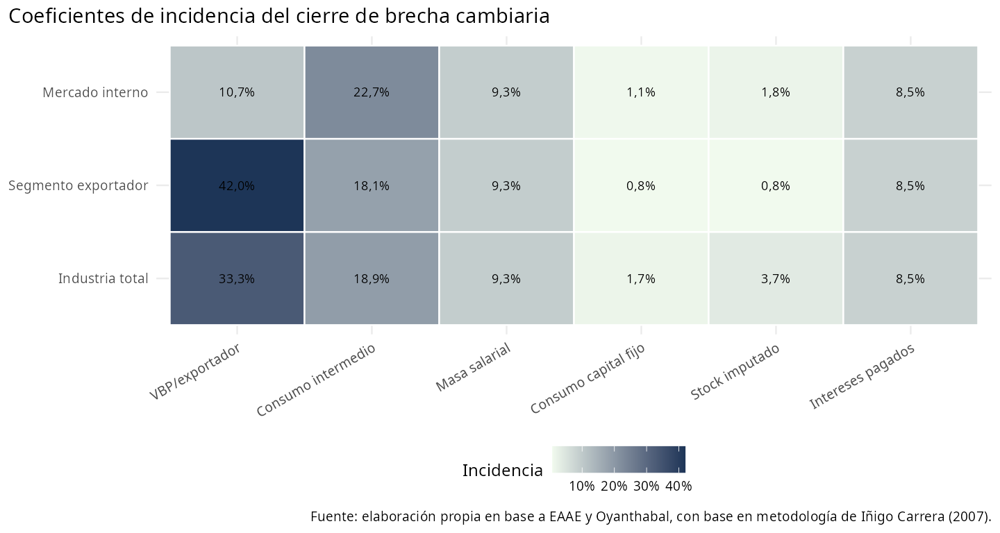
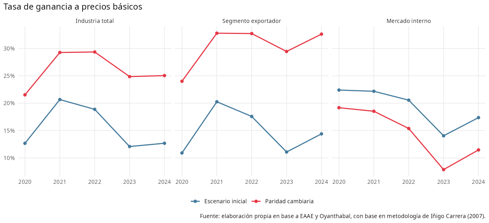
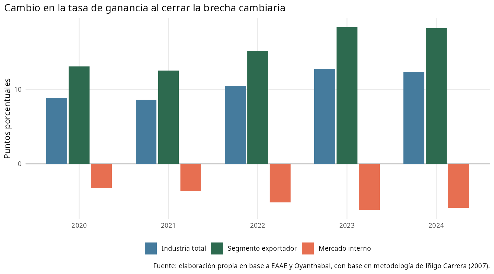
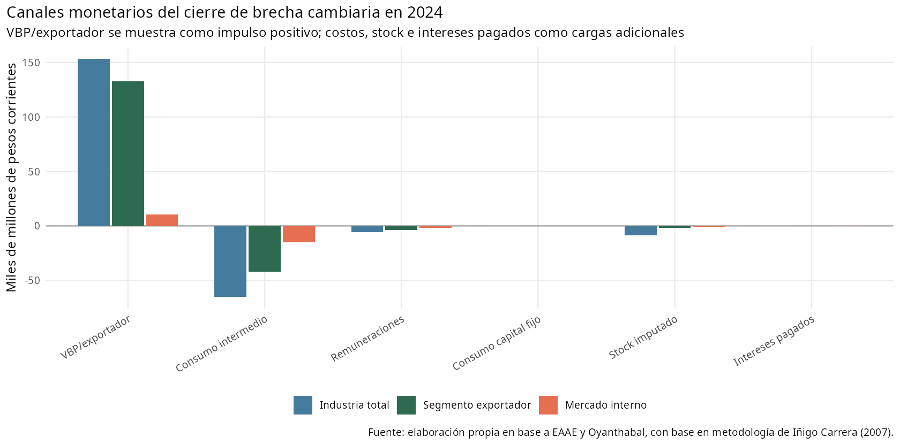
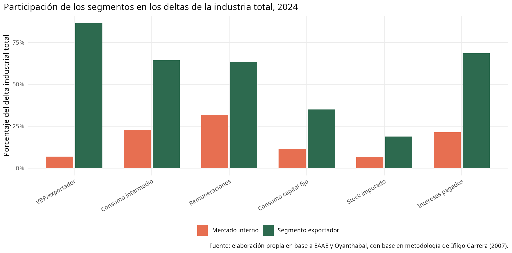

# Apropiación de riqueza por sobrevaluación cambiaria en la industria manufacturera uruguaya, 2020-2024

Fuente de trabajo: `data/analysis-data/20260826_panel_eaae_2020_2024_industria_escenario_devaluacion.xlsx`, hojas `escenario-inicial`, `tipo-cambio` y `devaluación-1`.

## Síntesis

El ejercicio dimensiona la apropiación de riqueza asociada a sostener un tipo de cambio comercial por debajo del tipo de cambio de paridad. Para ello compara los resultados corrientes observados de la industria manufacturera con un contrafactual anual en el que las magnitudes sensibles al tipo de cambio se valoran con la paridad. La simulación no modifica cantidades, productividad ni estructura productiva; aplica coeficientes de incidencia sobre componentes monetarios para estimar un impacto contable de corto plazo.

Las fuentes usadas son: EAAE para VBP, VAB, remuneraciones, consumo intermedio estimado, consumo de capital fijo, stock de capital y capital adelantado; Oyanthabal, con base en la metodología de Iñigo Carrera (2007), para los tipos de cambio comercial/paridad y los coeficientes de incidencia del ejercicio; y la clasificación operativa de subramas industriales 2020-2024 usada para separar industria exportadora, mercado interno y combustible.

Se trabaja desde 2020 porque en ese tramo la fuente opera con ramas homogéneas. Extender el ejercicio al panel completo exigiría procesar distintas versiones CIIU, lo que vuelve incompatible diferenciar con criterio uniforme el segmento industrial exportador y el segmento orientado al mercado interno. Complementariamente, el período 2020-2024 es razonable para una lectura en valores corrientes porque evita grandes saltos de nivel asociados a cambios clasificatorios.

Con coeficientes diferenciados por sección, el resultado central es una fractura interna dentro de la manufactura. Bajo el contrafactual de paridad, la industria total aumenta su tasa de ganancia a precios básicos, pero ese resultado es arrastrado por el segmento exportador. En 2024, el segmento exportador pasa de 14,4% a 32,6%, mientras que el segmento mercado interno cae de 17,4% a 11,5%.

## Supuestos y escenarios

- `escenario-inicial` contiene los valores corrientes observados para industria total, segmento exportador y segmento mercado interno.
- `devaluación-1` mantiene el nombre técnico de la hoja, pero analíticamente se interpreta como cierre anual de la brecha entre tipo de cambio comercial y tipo de cambio de paridad.
- El cálculo se realiza año a año mediante `factor_devaluacion = tipo_cambio_paridad_pesos_usd / tipo_cambio_comercial_pesos_usd - 1`; no contempla efectos acumulados ni respuestas dinámicas de cantidades, precios relativos o productividad.
- Desde otro punto de vista, el mismo ejercicio permite dimensionar el efecto que tiene sostener un tipo de cambio sobrevaluado sobre la apropiación de riqueza por parte de la industria.
- El canal positivo se modela sobre `vbp_pp` como `VBP/exportador`; los canales negativos se modelan sobre consumo intermedio, remuneraciones, consumo de capital fijo, stock imputado e intereses pagados.
- Los intereses industriales son una serie agregada de manufactura y se distribuyen por segmento según participación en `vbp_pp`.
- El grupo `combustible` no se presenta como segmento autónomo en el libro de resultados ni en esta minuta; queda incorporado en la industria total y se conserva en el panel CSV para trazabilidad contable.

Ramas incluidas en el segmento exportador:
- 10: Elaboración de productos alimenticios
- 11 y 12: Elaboración de bebidas y elaboración de productos de tabaco
- 13: Fabricación de productos textiles
- 15: Fabricación de cueros y productos conexos
- 16: Producción de madera y fabricación de productos de madera y corcho, excepto muebles
- 17: Fabricación de papel y de los productos de papel
- 22: Fabricación de productos de caucho y plástico

Ramas incluidas en el segmento mercado interno:
- 14: Fabricación de prendas de vestir
- 18: Actividades de impresión y reproducción de grabaciones
- 20: Fabricación de sustancias y productos químicos
- 21: Fabricación de productos farmacéuticos, sustancias químicas medicinales y de productos botánicos
- 23: Fabricación de otros productos minerales no metálicos
- 24: Fabricación de metales comunes
- 25: Fabricación de productos derivados del metal, excepto maquinaria y equipo
- 26 y 27: Fabricación de los productos informáticos, electrónicos y ópticos. Fabricación de equipo eléctrico
- 28: Fabricación de maquinaria y equipo n.c.p
- 29 y 30: Fabricación de vehículos automotores, remolques y semirremolques. Fabricación de otros tipos de equipo de transporte
- 31: Fabricación de muebles
- 32: Otras industrias manufactureras
- 33: Reparación e instalación de la maquinaria y equipo


## Coeficientes de incidencia

Los coeficientes indican qué proporción de cada variable queda expuesta al cierre de la brecha cambiaria. Desde el punto de vista del contrafactual de paridad, `VBP/exportador` tiene signo positivo para la ganancia, porque eleva la valorización de ventas asociadas al tipo de cambio. En cambio, consumo intermedio, masa salarial, consumo de capital fijo e intereses pagados operan como gastos o costos; el stock imputado afecta negativamente la tasa porque eleva el capital adelantado.



| Sección | Variable afectada | Incidencia | Efecto contable ante paridad |
| --- | --- | --- | --- |
| Industria total | Consumo capital fijo | 1,7% | Negativo: eleva costos o gastos |
| Industria total | Consumo intermedio | 18,9% | Negativo: eleva costos o gastos |
| Industria total | Intereses pagados | 8,5% | Negativo: eleva costos o gastos |
| Industria total | Masa salarial | 9,3% | Negativo: eleva costos o gastos |
| Industria total | Stock imputado | 3,7% | Negativo: eleva capital adelantado |
| Industria total | VBP/exportador | 33,3% | Positivo para la ganancia |
| Mercado interno | Consumo capital fijo | 1,1% | Negativo: eleva costos o gastos |
| Mercado interno | Consumo intermedio | 22,7% | Negativo: eleva costos o gastos |
| Mercado interno | Intereses pagados | 8,5% | Negativo: eleva costos o gastos |
| Mercado interno | Masa salarial | 9,3% | Negativo: eleva costos o gastos |
| Mercado interno | Stock imputado | 1,8% | Negativo: eleva capital adelantado |
| Mercado interno | VBP/exportador | 10,7% | Positivo para la ganancia |
| Segmento exportador | Consumo capital fijo | 0,8% | Negativo: eleva costos o gastos |
| Segmento exportador | Consumo intermedio | 18,1% | Negativo: eleva costos o gastos |
| Segmento exportador | Intereses pagados | 8,5% | Negativo: eleva costos o gastos |
| Segmento exportador | Masa salarial | 9,3% | Negativo: eleva costos o gastos |
| Segmento exportador | Stock imputado | 0,9% | Negativo: eleva capital adelantado |
| Segmento exportador | VBP/exportador | 42,0% | Positivo para la ganancia |

## Resultados principales

La tasa de ganancia a precios básicos de la industria total aumenta en promedio +10,6 pp entre 2020 y 2024. En el segmento exportador el aumento promedio es +15,5 pp. En cambio, el segmento mercado interno muestra una variación promedio de -4,8 pp, lo que indica que el encarecimiento de costos supera el impulso positivo sobre el VBP/exportador.





| Sección | TG base prom. | TG paridad prom. | Cambio prom. | TG base 2024 | TG paridad 2024 | Cambio 2024 | Var. ganancia 2024 |
| --- | --- | --- | --- | --- | --- | --- | --- |
| Segmento exportador | 14,8% | 30,3% | +15,5 pp | 14,4% | 32,6% | +18,2 pp | 131,9% |
| Industria total | 15,4% | 26,0% | +10,6 pp | 12,7% | 25,0% | +12,4 pp | 105,8% |
| Mercado interno | 19,3% | 14,5% | -4,8 pp | 17,4% | 11,5% | -5,9 pp | -30,3% |

## Mecanismo de transmisión en 2024

En 2024, el aumento de `vbp_pp` es el principal canal positivo. El gráfico y el cuadro expresan los deltas en miles de millones de pesos corrientes. Para la industria total equivale a 153,5 miles de millones de pesos corrientes. Ese impulso se compensa parcialmente por el aumento de consumo intermedio, remuneraciones, consumo de capital fijo, stock imputado e intereses pagados. La asimetría por segmento es clara: el segmento exportador capta la mayor parte del impulso por VBP/exportador, mientras que en mercado interno el aumento de costos queda por encima del impulso de ventas.



| Sección | Delta VBP/exportador | Delta CI | Delta remuneraciones | Delta CCF | Delta stock | Delta intereses pagados |
| --- | --- | --- | --- | --- | --- | --- |
| Industria total | 153,5 | 64,9 | 5,6 | 0,25 | 8,7 | 0,26 |
| Segmento exportador | 132,8 | 41,8 | 3,6 | 0,09 | 1,6 | 0,18 |
| Mercado interno | 10,5 | 14,9 | 1,8 | 0,03 | 0,6 | 0,06 |

## Contribución relativa de los segmentos

La lectura por participaciones muestra que, en 2024, el segmento exportador explica 86,5% del delta de VBP/exportador de la industria total, frente a 6,9% del segmento mercado interno. Esta concentración explica por qué la mejora agregada de la industria total no debe leerse como un efecto homogéneo para toda la manufactura.

En magnitudes de 2024, el VBP/exportador de la industria total aumenta 153,5 miles de millones de pesos corrientes, mientras los gastos modelados aumentan 71,1 y el stock imputado aumenta 8,7. En el segmento exportador, el aumento de VBP/exportador es 132,8 frente a gastos por 45,6 y stock por 1,6. En mercado interno, el VBP/exportador aumenta 10,5, pero los gastos aumentan 16,7 y el stock 0,6.



| Componente | Exportador / industria total | Mercado interno / industria total |
| --- | --- | --- |
| VBP/exportador | 86,5% | 6,9% |
| Consumo intermedio | 64,4% | 22,9% |
| Remuneraciones | 63,2% | 31,8% |
| Consumo capital fijo | 35,1% | 11,4% |
| Stock imputado | 19,0% | 6,7% |
| Intereses pagados | 68,6% | 21,3% |

## Interpretación

La simulación sugiere que la sobrevaluación cambiaria redistribuye condiciones de rentabilidad dentro de la industria. Para el segmento exportador, cerrar la brecha con la paridad elevaría el VBP en pesos por encima del encarecimiento de costos y aumentaría con fuerza la tasa de ganancia. Desde la lectura inversa, sostener el tipo de cambio comercial sobrevaluado reduce esa apropiación potencial. Para el segmento mercado interno, la menor incidencia del canal VBP y la mayor presión relativa de costos implican que el cierre de la brecha deteriora la rentabilidad.

Por lo tanto, el resultado agregado de la industria total debe interpretarse con cautela: expresa una mejora promedio bajo paridad, pero esa mejora proviene de una composición sectorial desigual. La sobrevaluación no afecta de manera equivalente a toda la manufactura: limita especialmente la valorización del segmento exportador y, al mismo tiempo, contiene costos para actividades más orientadas al mercado interno.

## Anexo técnico

La fórmula general aplicada es:

```text
delta_variable = variable_base * incidencia_seccion_variable * factor_devaluacion
variable_devaluacion = variable_base + delta_variable
factor_devaluacion = tipo_cambio_paridad_pesos_usd / tipo_cambio_comercial_pesos_usd - 1
```

La ganancia a precios básicos bajo cierre de brecha/paridad se calcula como:

```text
ganancia_pb_devaluacion =
  ganancia_pb + delta_vbp_pp - delta_consumo_intermedio_estimado -
  delta_remuneraciones - delta_consumo_capital_fijo
```

El capital total adelantado bajo cierre de brecha/paridad incorpora el cambio en stock imputado y en capital circulante:

```text
capital_total_adelantado_devaluacion =
  capital_total_adelantado + delta_stock_capital_imputado +
  (delta_remuneraciones + delta_consumo_intermedio_estimado) / rotacion_calibrada_sobre_6_6
```

La tasa de ganancia a precios básicos bajo cierre de brecha/paridad se calcula como:

```text
tasa_ganancia_pb_devaluacion =
  ganancia_pb_devaluacion / capital_total_adelantado_devaluacion
```
