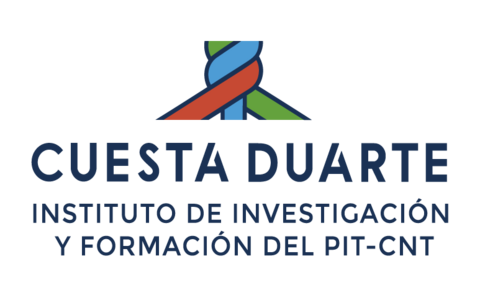

::: {.institutional-header}
{.institution-logo fig-alt="PIT-CNT Uruguay"}
:::

## Sobre el proyecto

El proyecto *Tipo de cambio y perspectivas del desarrollo industrial en Uruguay
(2000 a la actualidad)* estudia el papel del tipo de cambio en la acumulación
de capital y el desarrollo de la industria manufacturera uruguaya. La
investigación analiza la relación entre la evolución cambiaria, la apropiación
de renta de la tierra y otras fuentes de riqueza extraordinaria, y sus efectos
sobre la rentabilidad industrial, los costos de producción, los salarios, el
mercado interno y la competitividad internacional. A partir de la construcción
de indicadores para el período 2000-2025, el proyecto combina tanto un análisis
agregado de la industria como un foco en su segmento exportador y mercado
internista. Esto con el objetivo de aportar evidencia para la discusión sobre
las alternativas y tensiones que atraviesan una estrategia de desarrollo
productivo en Uruguay.

Este sitio empaqueta los principales resultados reproducibles del proyecto:
sistematización de fuentes económicas de Uruguay, construcción de paneles
EAAE-BCU, resultados sobre la industria manufacturera y modelamiento de
apropiación de riqueza asociada a la sobrevaluación cambiaria.

El repositorio mantiene una organización inspirada en Project TIER: los datos
primarios se preservan en `data/input-data/`, los scripts reproducibles en
`command-files/`, las bases procesadas en `data/analysis-data/`, las minutas en
`docs/` y las figuras en `output/figures/`.

## Accesos principales

::: {.download-panel}
::: {.download-item}
**Resultados tasa de ganancia**

XLSX largo con economía total, industria total y subramas.

[Descargar XLSX](data/analysis-data/resultados_eaae_bcu_total_industria_subrama.xlsx){.button-link}
:::

::: {.download-item}
**Modelamiento devaluación**

XLSX con escenario inicial, tipo de cambio y dos escenarios modelados.

[Descargar XLSX](data/analysis-data/panel_eaae_2020_2024_industria_escenario_devaluacion.xlsx){.button-link}
:::

::: {.download-item}
**Repositorio reproducible**

Código, datos procesados, documentación y figuras del proyecto.

[Ver GitHub](https://github.com/feliperuizbruzzone/economia-uruguay){.button-link}
:::
:::

## Estructura del entregable

El sitio está organizado en cuatro entradas sustantivas. La primera presenta el
trabajo de sistematización y sus antecedentes. La segunda sintetiza los
resultados de tasa de ganancia EAAE-BCU de largo plazo. La tercera integra el
modelamiento de devaluación para la industria manufacturera. La cuarta permite explorar
simulaciones interactivas variando el cierre de la brecha cambiaria y la
intensidad de incidencia de cada componente.

::: {.technical-note}
El sitio es estático: no requiere servidor, Shiny ni ejecución de R o Python
por parte de la persona usuaria. Los módulos interactivos funcionan en el
navegador a partir de archivos JSON preprocesados.
:::

## Equipo de investigación

El proyecto es desarrollado por un equipo especializado en economía política,
desarrollo industrial, ciencia de datos y análisis cuantitativo. La dirección
está a cargo del **Dr. Juan Kornblihtt (CONICET / ICI-UNGS / FFyL-UBA)**,
investigador especializado en acumulación de capital, renta de la tierra y
desarrollo económico en América Latina. Participan como investigadores el
**Dr. Emiliano Mussi (CIC-PBA / ICI-UNGS)**, especializado en estructura
productiva, industria y cadenas de valor, y el **Dr. Felipe Ruiz Bruzzone
(Fundación Nodo XXI)**, especializado en ciencia de datos y estudios
laborales, económicos y de política pública en América Latina. El proyecto se
desarrolla para el PIT-CNT de Uruguay.
